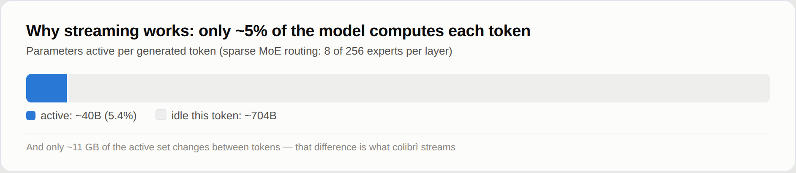
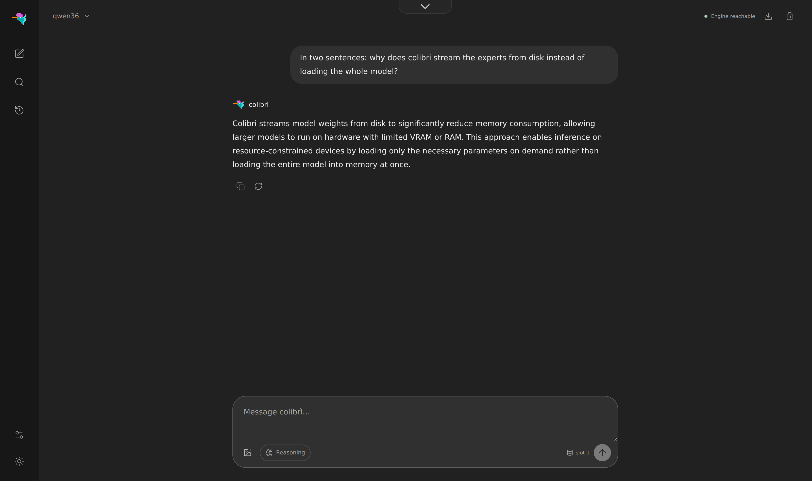
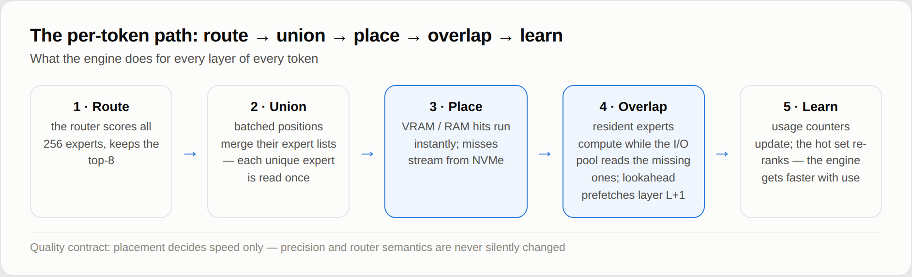
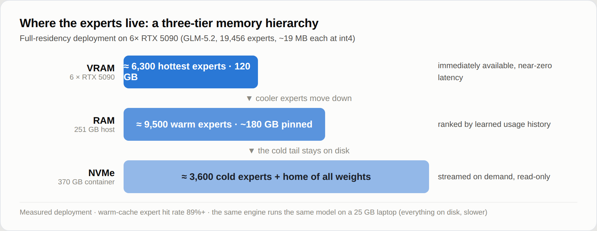
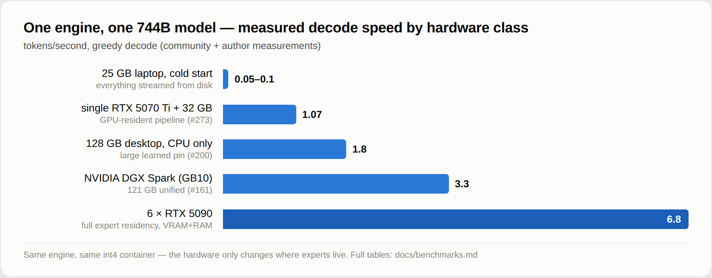

<p align="center">
  
</p>

<p align="center">
  <a href="https://justvugg.github.io/colibri"></a>
  <a href="https://github.com/JustVugg/colibri/releases"></a>
</p>

<p align="center">
  <a href="https://justvugg.github.io/colibri"><b>Website</b></a> ·
  <a href="https://discord.gg/RXV83nSZdk"><b>Discord</b></a> ·
  <a href="README.md">English</a> · <a href="README.zh-CN.md">简体中文</a> · <a href="README.zh-TW.md">繁體中文</a> · <a href="README.it.md">Italiano</a> · <a href="README.ja.md">日本語</a> · <a href="README.id.md">Bahasa Indonesia</a> · Português (Brasil)
</p>

**Motor minúsculo, modelo imenso.** O colibri roda modelos abertos muito grandes
na máquina que você já tem. Um modelo de mistura de especialistas com centenas de
bilhões de parâmetros usa apenas uma pequena parte de si mesmo para cada token;
por isso o colibri mantém essa parte na RAM e lê o resto — os especialistas — do
disco, quando o modelo os pede. C puro, um arquivo por família de modelos, sem
necessidade de GPU.

Treze motores rodam hoje. Dez são para modelos de linguagem: **GLM-5.2/5.3**,
**GLM-5.3-Flash**, **Inkling**, **Kimi K3**, **DeepSeek V4 Flash**,
**DeepSeek V4.1 Flash**, **MiMo-V2.6 Flash** (e Pro), **Qwen3.8-Flash-Next**,
**Qwen3.6** (que também roda o Qwen3-Coder e o denso Qwen3.8-27B) e
**OLMoE**. Um desenha figuras: **Qwen-Image-2.1**. Dois respondem a decisões:
**Laya** e **GLiNER2.5-Decide**, com um terceiro modelo de decisão, o **Clef**, no
motor Qwen3.6. [Qual deles para a minha máquina](#which-model-for-my-machine)

```
$ ./coli chat
  colibri v2.0.0 · GLM-5.2 · 744B MoE · int4 · streaming CPU
  ✓ ready in 32s · resident 9.9 GB
  › ciao!
  ◆ Ciao! Come posso aiutarti oggi?
```

<a id="get-started"></a>
<a id="the-one-step-way"></a>

## Comece em um único passo

Você precisa de um computador com **pelo menos 8 GB de RAM** (16 GB ou mais é
melhor), **22 GB livres no disco** para o menor modelo, e conexão com a internet.
A placa de vídeo é opcional.

**Windows**

1. Nesta página, clique em **Code**, depois em **Download ZIP**, e descompacte.
2. Dê um duplo clique em **`START-HERE.bat`** na pasta descompactada. Se o Python
   não estiver instalado, ele oferece para instalar para você.

**Linux** (Ubuntu e Debian; outras distribuições têm os mesmos pacotes com outros
nomes)

```bash
sudo apt install git python3 build-essential
git clone https://github.com/JustVugg/colibri
cd colibri
./start-here.sh
```

**macOS** (com [Homebrew](https://brew.sh))

```bash
xcode-select --install
brew install libomp git python
git clone https://github.com/JustVugg/colibri
cd colibri
./start-here.sh
```

Você responde a uma pergunta — qual modelo — e o Enter aceita a recomendação.
Então a configuração:

1. **examina a sua máquina**: RAM, disco livre, CPU e GPUs;
2. **recomenda um modelo que caiba**: a parte do modelo que fica sempre na RAM,
   mais um cache mínimo de especialistas, precisa caber na sua RAM, e o download,
   no seu disco;
3. **obtém o motor**: ele é compilado para a sua máquina quando há um compilador;
   caso contrário, baixa o já compilado, que roda na CPU e, no Linux e no Windows,
   também numa GPU Vulkan. Ele compila para a sua GPU quando isso compensa: CUDA
   para placa NVIDIA no Linux, quando o kit CUDA está instalado; senão, Vulkan.
   Numa GPU dedicada ele sempre compila; numa GPU integrada, que compartilha a RAM
   da CPU, só para os modelos medidos como mais rápidos ali (Qwen3.6, Qwen3-Coder
   e Qwen3.8-Flash-Next). Se faltar algum pacote, ele imprime o comando exato para
   instalar e segue na CPU; rode a configuração de novo depois e ele recompila
   para a GPU;
4. **baixa o modelo**, com progresso e retomada: pare quando quiser, rode de novo
   e ele continua de onde parou;
5. **inicia o colibri e abre o painel** no seu navegador, e imprime os endereços
   que outras aplicações podem usar:

```
Starting colibri
  Browser:             http://127.0.0.1:8000/
  OpenAI base URL:     http://127.0.0.1:8000/v1
  Anthropic base URL:  http://127.0.0.1:8000
  stop: press Ctrl+C here (or close this window)
```

**Na próxima vez**, rode `START-HERE.bat` ou `./start-here.sh` de novo: o colibri
inicia direto, sem download e sem compilação. `c/coli status` mostra o que está
instalado e se está rodando, e `c/coli stop` o encerra (`c\coli.cmd status` e
`c\coli.cmd stop` no Windows).

As opções vêm depois de `./start-here.sh` ou `START-HERE.bat`:

| Opção | O que faz |
|---|---|
| `--list` | todos os modelos confrontados com esta máquina, e por que um não cabe |
| `--model ID` | instala aquele modelo (os ids estão em [the tables below](#which-model-for-my-machine)) |
| `--yes` | sem perguntas: aceite a recomendação |
| `--dir DIR` | coloca os modelos em outro disco (padrão `~/colibri-models`) |
| `--backend vulkan`, `cuda` ou `cpu` | escolha você mesmo a compilação do motor; `--no-gpu` é `--backend cpu` |
| `--model-dir DIR` | usa um modelo que você já baixou |
| `--reconfigure` | escolhe outro modelo |

O que cada etapa faz, em detalhe: [docs/quickstart.md](docs/quickstart.md#the-one-step-way).

### Se algo der errado

| O que você vê | O que fazer |
|---|---|
| parou durante o download | rode o mesmo comando de novo: ele retoma a partir dos bytes que já estão no disco |
| `to use the GPU through ..., first run: <command>` | rode aquele comando e depois a configuração de novo: ela recompila para a GPU e não baixa nada outra vez |
| `the ... build failed`, por exemplo `Unsupported gpu architecture`, quando o kit CUDA instalado não suporta mais a placa | a configuração confere o kit contra a placa antes e escolhe Vulkan por conta própria, dizendo o motivo; se uma compilação ainda falhar, ela oferece a próxima (Vulkan, depois a CPU). `./start-here.sh --backend vulkan` força o Vulkan; `--no-gpu` fica na CPU |
| `needs N GB free for the download` | `--dir` com uma pasta num disco maior |
| no WSL, a pasta do modelo fica em `/mnt/c` | mantenha-a no disco do Linux (o padrão, `~/colibri-models`): o `/mnt/c` é muitas vezes mais lento |
| você atualizou o checkout (`git pull`) | rode `./start-here.sh` de novo: ele recompila o motor quando as fontes mudaram e então o inicia |
| qualquer outra coisa | `c/coli logs -n 50` mostra o log de um servidor iniciado em segundo plano (um iniciado em primeiro plano imprime no próprio terminal) e `c/coli logs --install` o da configuração; abra uma [issue](https://github.com/JustVugg/colibri/issues) com as últimas linhas que a configuração imprimiu |

### Deixe o seu assistente de IA configurar

Se você usa um assistente de programação com IA, ele pode fazer tudo isso por
você. Peça:

> Configure o colibri nesta máquina seguindo docs/AI_SETUP.md de https://github.com/JustVugg/colibri

O [docs/AI_SETUP.md](docs/AI_SETUP.md) dá ao assistente cada etapa como um comando
com resultado legível por máquina, e manda perguntar antes de baixar um modelo ou
instalar um pacote do sistema. Assistentes que falam o Model Context Protocol
podem usar o servidor MCP do colibri: `coli mcp` oferece ferramentas para detectar
o hardware, recomendar um modelo, instalar, iniciar, parar e verificar
([docs/MCP_SERVER.md](docs/MCP_SERVER.md)).

### Ou manualmente

Para escolher cada etapa você mesmo (uma versão já compilada ou uma compilação a
partir do código, qualquer modelo das tabelas abaixo, e então `coli chat`,
`coli web` ou `coli serve`), veja [Install by hand](#install-by-hand), ou o
[Guia de Início Rápido](docs/quickstart.md), com cada plataforma passo a passo.

## O que é o colibri, e por quê

Um modelo de mistura de especialistas é enorme em disco e pequeno por token. O
GLM-5.2 tem 744 bilhões de parâmetros, usa cerca de 40 bilhões para cada token, e
apenas cerca de 11 GB desses mudam de um token para o outro: os especialistas
roteados.

<p align="center">
  
</p>

Portanto o modelo não precisa caber na memória rápida; ele precisa ser
**posicionado**. A parte densa (atenção, especialistas compartilhados,
embeddings) fica na RAM. Os especialistas roteados ficam no disco e são lidos
quando o roteador os pede, através de um cache que aprende quais especialistas o
seu trabalho usa. Uma GPU, quando existe, guarda os especialistas mais quentes e
as camadas densas. Onde um peso fica muda a rapidez com que a resposta chega, não
quais pesos nem quais decisões do roteador a produzem.

Por quê: para rodar modelos desse porte no hardware que as pessoas já possuem,
para vê-los trabalhar (o painel mostra cada especialista no momento em que é
acionado) e para manter o motor pequeno o bastante para que qualquer pessoa possa
medi-lo e torná-lo mais rápido. O colibri é também uma plataforma aberta de
pesquisa: uma otimização ganha o seu lugar com uma medição ponta a ponta
reproduzível, e a política padrão nunca altera em silêncio a precisão do modelo
nem a semântica do roteador. Menos memória rápida pode custar velocidade; não pode
redefinir o modelo sem avisar. [How it works](#how-it-works) tem os detalhes.

<a id="which-model-for-my-machine"></a>

## Qual modelo para a minha máquina

A configuração recomenda o modelo mais capaz que roda a partir da RAM na sua
máquina, e lista logo abaixo os maiores, que transmitem do disco.
`./start-here.sh --list` mostra todos eles confrontados com a sua máquina. As
tabelas seguem o próprio catálogo da configuração
([`c/setup_catalog.py`](c/setup_catalog.py)); os downloads são os tamanhos que o
Hugging Face informa para cada repositório.

- **RAM** são dois números: abaixo do primeiro o modelo não inicia; a partir do
  segundo ele roda conforme medido.
- **GPU** é o que a configuração consegue compilar para aquele motor
  ([GPUs](#gpus)). *Integrada também* quer dizer que ele também usa uma GPU
  integrada, onde esses motores foram medidos como mais rápidos; os outros usam
  apenas uma GPU dedicada.
- **Medido** é o que foi cronometrado na máquina indicada: a velocidade de
  decodificação, para os modelos de chat. As letras são as máquinas listadas
  abaixo das tabelas. Em branco significa que ninguém mediu ainda.

**Modelos pequenos, que rodam a partir da RAM**

| Modelo | `--model` | Download | RAM | GPU | Medido |
|---|---|---|---|---|---|
| **Qwen3.6-35B-A3B**: chat com raciocínio e ferramentas | `qwen36-35b` | 23 GB | 10 / 20 GB | CUDA, Vulkan (integrada também) | 6,0 tok/s na CPU, 9,9 com Vulkan na GPU integrada (A); 30,0 com CUDA (C) |
| Qwen3-Coder-30B-A3B: código e chamadas de ferramentas, sem raciocínio | `qwen3-coder-30b` | 19 GB | 8 / 18 GB | CUDA, Vulkan (integrada também) | 8,5-9,6 tok/s com todos os especialistas na RAM, 5,1 com 32 por camada (A, CPU) |
| **Qwen-Image-2.1**: texto para figura, licença não comercial | `qwen-image-2.1` | 33 GB | 12 / 18 GB | Vulkan | uma figura de 768x512 em 2 min 40 s (8 núcleos Zen 4, CPU) |

**Modelos grandes, cujos especialistas transmitem do disco** (o disco determina a
velocidade: um NVMe rápido ajuda mais)

| Modelo | `--model` | Download | RAM | GPU | Medido |
|---|---|---|---|---|---|
| DeepSeek V4 Flash REAP 150B: 132 dos 256 especialistas | `deepseek-v4-flash-reap` | 85 GB | 16 / 32 GB | CUDA, Vulkan | |
| **DeepSeek V4 Flash** (284B): ferramentas | `deepseek-v4-flash` | 167 GB | 16 / 32 GB | CUDA, Vulkan | 0,93 tok/s com 32 GB (Ryzen 7 5800X), 1,24 com 63 GB (Ryzen 9 5950X), só CPU; 1,5-1,6 com CUDA (RTX 5080, 32 GB, dois NVMe) |
| **MiMo-V2.6 Flash** (309B): visão e ferramentas | `mimo-v2.6-flash` | 172 GB | 32 / 52 GB | Vulkan | 2,34-3,37 tok/s (A, CPU) |
| **Qwen3.8-Flash-Next** (125B + 51B n-gram): visão e ferramentas | `qwen38-flash-next` | 186 GB | 24 / 32 GB | CUDA, Vulkan (integrada também) | 1,91-2,56 tok/s com 32-96 especialistas por camada; 3,99 com os especialistas int4 opcionais (A, CPU) |
| **GLM-5.2** (744B): o modelo de referência, com o cabeçote MTP | `glm-5.2` | 429 GB | 16 / 24 GB | CUDA, Vulkan | 0,05-0,1 tok/s a frio num laptop de 25 GB; 1,83 num Ryzen AI Max+ 395 de 128 GB; 9,0-9,2 com 6x RTX 5090 |
| GLM-5.3 (744B): o mesmo motor, sem cabeçote MTP | `glm-5.3` | 419 GB | 16 / 24 GB | CUDA, Vulkan | |
| **Inkling** (975B): especialistas int4, pesos densos bf16 | `inkling` | 514 GB | 120 / 128 GB como baixado; 25 GB após uma [conversão para denso](docs/inkling.md) | CUDA, Vulkan | 0,25 tok/s (Ryzen 9 7900, 187 GB, RTX A6000) |
| MiMo-V2.6 Pro (1,02T): visão e ferramentas | `mimo-v2.6-pro` | 564 GB | 54 / 64 GB | Vulkan | 0,66-0,79 tok/s (A, CPU) |
| **Kimi K3** (2,8T): o maior | `kimi-k3` | 1,56 TB | 32 / 64 GB | CUDA, Vulkan | cerca de 9,4 s por token, especialistas lidos a 6,3 GB/s |

<a id="other-supported-models"></a>

**Manualmente: uma etapa de conversão ou preparação depois do download**

| Modelo | Download, depois em disco | RAM | GPU | Medido |
|---|---|---|---|---|
| **OLMoE** (7B): pequeno, para aprender as ferramentas | 14 GB, 7 GB após conversão para int8 | 8 GB | Vulkan | 22-23 tok/s (A, CPU) |
| Qwen3.8-27B (denso): texto e imagens | 56 GB, 51 GB após conversão | 20 GB em int4, 30 GB em int8 | Vulkan | 3,45 tok/s em int4, 2,1 em int8 (servidor de CPU com 16 threads) |
| **GLM-5.3-Flash** (321B): visão e ferramentas | 328 GB, convertido shard a shard para 195 GB | 25 GB | CUDA, Vulkan | cerca de 20 s por token a quente, 44 s a frio (6 núcleos, 25 GB, disco comum) |
| **DeepSeek V4.1 Flash** (552B): visão e ferramentas, sem conversão mas com uma preparação única | 510 GB | cerca de 18 GB mais o cache de especialistas (pico de 24,8 GB com 8 por camada) | Vulkan | 0,21-0,24 tok/s (servidor de CPU com 16 threads mantendo 68% dos especialistas) |

**Modelos de decisão** (eles respondem a perguntas do
[System One](#system-one-a-decision-with-a-probability), não conversam)

| Modelo | Download, depois em disco | RAM | GPU | Medido |
|---|---|---|---|---|
| **Laya** (Convai Innovations), inglês | 0,85 GB | 1,7 GB | CPU | 219 ms para uma pergunta, 882 ms para três (B) |
| **GLiNER2.5-Decide** (fastino), inglês | 1,95 GB | 1,9 GB | CPU | 294 ms para uma pergunta, 897 ms para três (B, sob carga) |
| **Clef** (Cloudflare): Qwen3.8-27B com um cabeçote de decisão, também conversa | 55 GB, 52 GB após conversão | de 19 GB em int4 a 55 GB em f16 | CPU | 20,4 s por requisição em int8 (A) |

As máquinas:
**A** um desktop Ryzen 7 PRO 8700GE (8 núcleos, 61-64 GB DDR5, NVMe, Radeon 780M
integrada);
**B** um laptop i7-1355U;
**C** uma RTX 3070 de 8 GB numa máquina Threadripper 3945WX, com as camadas densas
e as camadas DeltaNet na placa (contêiner int4 por linha).
Cada número vem da página do modelo em [docs/](docs/) ou de
[the benchmark tables](docs/benchmarks.md), com as configurações exatas.

Cada família tem a sua página: [qwen36.md](docs/qwen36.md) (Qwen3.6, Qwen3-Coder,
Qwen3.8-27B), [qwen38.md](docs/qwen38.md), [deepseek-v4.md](docs/deepseek-v4.md),
[deepseek-v41.md](docs/deepseek-v41.md), [mimo.md](docs/mimo.md),
[glm53-flash.md](docs/glm53-flash.md), [inkling.md](docs/inkling.md),
[kimi_k3.md](docs/kimi_k3.md), [qwen-image.md](docs/qwen-image.md),
[laya.md](docs/laya.md), [gliner_decide.md](docs/gliner_decide.md),
[clef.md](docs/clef.md), e o GLM-5.2 no
[Guia de Início Rápido](docs/quickstart.md#3-get-the-model).
Checkpoints com a mesma arquitetura de um modelo suportado, como o KAT-Coder v2.5
no motor Qwen3.6, rodam sem alteração.

## GPUs

### Não é preciso GPU

Todo motor roda na CPU sem nada mais instalado. A GPU é um lugar mais rápido para
guardar os pesos, não um requisito: nos modelos grandes o disco determina a
velocidade, nos pequenos, a RAM.

### Vulkan: qualquer GPU

Todo motor de MoE pode usar qualquer GPU com driver Vulkan 1.2 (AMD, Intel,
NVIDIA, integrada ou dedicada) de duas maneiras:

- **o tier de especialistas**: um cache dos especialistas roteados na memória da
  GPU, preenchido na inicialização com os especialistas que as suas conversas
  anteriores usaram e se adaptando enquanto você conversa. A GPU calcula os
  especialistas que ela mantém, enquanto a CPU calcula o resto;
- **a cadeia densa**: uma camada inteira registrada como uma única submissão à
  GPU, com o estado de execução do modelo mantido na GPU de uma camada para a
  seguinte.

Medido na Radeon 780M integrada da máquina A, com os arquivos do modelo removidos
do cache de páginas antes de cada execução, 100 tokens decodificados
([vulkan.md](docs/vulkan.md#the-chain-on-a-radeon-780m)):

| | CPU | Vulkan, tier de especialistas | Vulkan, tier e cadeia densa |
|---|---|---|---|
| Qwen3.6-35B-A3B, decodificação | 6,0 tok/s | 8,0 tok/s | **9,9 tok/s** |
| Qwen3.6-35B-A3B, um prompt de 512 tokens | 35,7 s | 12,2 s | **9,5 s** |
| Qwen3.8-Flash-Next (especialistas int4), decodificação | 3,5 tok/s | **3,8 tok/s** | 3,2 tok/s |
| Qwen3.8-Flash-Next, um prompt de 512 tokens | 43,6 s | 38,7 s | **30,1 s** |
| OLMoE, decodificação (a quente) | **23,1 tok/s** | 12,8 tok/s | 17,3 tok/s |

Uma GPU integrada compartilha a RAM da CPU. O que ela economiza é o trabalho e as
leituras de disco dos especialistas que ela mantém; por isso compensa num modelo
como o Qwen3.6, e um modelo pequeno cujos especialistas já estão na RAM, como o
OLMoE, pode perder. É por isso que a configuração liga o Vulkan numa GPU integrada
apenas para o Qwen3.6, o Qwen3-Coder e o Qwen3.8-Flash-Next, e por isso cada motor
decide sozinho se roda ali a cadeia densa (Qwen3.6 sim, Qwen3.8 não).
`--backend vulkan` pede Vulkan de qualquer maneira.

**Ligar ou desligar a GPU.** `coli setup --backend vulkan` usa a GPU para qualquer
modelo, e `coli setup --backend cpu` (ou `--no-gpu`) mantém tudo na CPU. Um motor
compilado com Vulkan só usa a GPU com `COLI_VULKAN=1` no ambiente de `coli chat`,
`serve` ou `web` (a configuração define isso quando escolheu Vulkan); sem ela, o
motor roda na CPU. Com a GPU ligada, `COLI_VK_CHAIN=0` mantém o tier de
especialistas e roda as camadas densas na CPU. Numa GPU integrada, experimente os
dois: num laptop com Intel Iris Xe (Core i7-1355U), o Qwen3.6 decodificou 2,1 tok/s
na CPU, 1,7 a 1,9 com Vulkan, e 2,1 com a cadeia densa desligada.

Numa GPU dedicada a configuração compila Vulkan para todos os motores (CUDA
primeiro, onde o motor tem e o kit está instalado), com as camadas densas na
placa. É para esse caso que o projeto existe. **Ainda não medimos uma GPU dedicada
nós mesmos.** O primeiro número vem de um usuário: Qwen3.6 a 17-19 tok/s numa Tesla
V100 de 16 GB, com o tier de especialistas e a cadeia densa
([#1852](https://github.com/JustVugg/colibri/issues/1852)). (Antes dele, o caminho
Vulkan anterior do GLM-5.2 decodificou 1,7-1,8 tok/s numa RX 9070 dedicada.)
Números da sua placa são bem-vindos.

**Placas sem Resizable BAR** agora funcionam. Uma placa assim (toda placa Turing,
placas Ampere no firmware de lançamento, placas AMD mais antigas com a opção
desligada) deixa a CPU escrever diretamente apenas cerca de 256 MB da sua memória;
o colibri agora copia os pesos por um buffer intermediário, por conta própria. O
caminho é testado forçando-o e emulando a janela pequena em três dispositivos, e
não custa nada mensurável na 780M; não foi medido numa placa sem Resizable BAR
([vulkan.md](docs/vulkan.md#memory-placement-without-resizable-bar)).

A CI verifica o caminho Vulkan de cada motor contra os tokens da CPU, num driver
de software. A GPU soma os números em outra ordem e mantém algumas ativações em
f32 onde a CPU as arredonda, então uma resposta longa pode divergir da CPU numa
palavra ([vulkan.md](docs/vulkan.md#the-other-engines)).

### CUDA: placas NVIDIA

A configuração compila CUDA no Linux quando o kit CUDA está instalado, para os
motores que têm caminho CUDA: GLM-5.2/5.3, GLM-5.3-Flash, Inkling, Kimi K3,
DeepSeek V4 Flash, Qwen3.8-Flash-Next, e Qwen3.6 com Qwen3-Coder. No Windows o
motor CUDA é uma DLL separada ([windows.md](docs/windows.md)), e toda versão vem
com ela compilada: `colibri-<version>-windows-x86_64-cuda.zip` tem
`coli_cuda.dll` (placas de compute capability 8.0 e mais novas) e os motores
colibri, qwen36 e kimi_k3 que a carregam. Descompacte sobre o arquivo principal e
a configuração escolhe CUDA.

- **O tier de especialistas em VRAM** mantém na placa os especialistas mais
  quentes, escolhidos a partir do roteamento medido; os que faltam calculam na CPU
  ao mesmo tempo. O Qwen3.6 em duas placas de 8 GB (RTX 3070 e Quadro RTX 4000)
  decodificou 11,3 tok/s com histórico a quente
  ([qwen36-cuda-tier.md](docs/qwen36-cuda-tier.md)); o GLM-5.2 em seis RTX 5090 com
  todos os especialistas residentes, 9,0-9,2 tok/s
  ([benchmarks.md](docs/benchmarks.md)); o DeepSeek V4 Flash numa RTX 5080, 1,5-1,6
  tok/s e um prompt de 3.324 tokens em 90 s
  ([deepseek-v4.md](docs/deepseek-v4.md)).
- **Novidade no Qwen3.6: as camadas DeltaNet na placa** (`Q36_DN_GPU=1`,
  opcional). Cada uma das 30 camadas DeltaNet do Qwen3.6 copiava seus dados entre
  a placa e a CPU quatro vezes por token; agora um token de decodificação roda a
  camada inteira na placa, com o estado recorrente guardado na VRAM. Numa RTX 3070
  com as camadas densas na VRAM: 25,4 a 30,0 tok/s
  ([qwen36-cuda-tier.md](docs/qwen36-cuda-tier.md#the-deltanet-layer-on-the-card-q36_dn_gpu1)).
- **Placas mais antigas.** Se o kit CUDA não compila mais para a sua placa (CUDA
  13 e uma V100, em [#1852](https://github.com/JustVugg/colibri/issues/1852)), a
  configuração percebe isso antes de compilar e usa a placa via Vulkan, dizendo o
  motivo; um kit CUDA 12.x traz o caminho CUDA de volta. O tier CUDA do DeepSeek V4
  também compila para Pascal e Turing
  (`CUDA_ARCH=portable-pre-ampere NO_TC=1`).

Tudo isso: [docs/cuda.md](docs/cuda.md).

### Apple Silicon

Um backend Metal faz a matemática dos especialistas na GPU de memória unificada
para vários motores ([docs/metal.md](docs/metal.md)). O arquivo macOS da versão
traz `colibri`, `inkling` e `kimi_k3` compilados com ele: `COLI_METAL=1`
(`K3_METAL=1` para o Kimi K3) o liga, e sem isso eles rodam na CPU. A partir do
código, compile com `METAL=1`; a configuração de um passo compila para a CPU.

<a id="system-one-mode-ask-a-closed-question"></a>

<a id="system-one-a-decision-with-a-probability"></a>

## System One: uma decisão com uma probabilidade

A maior parte do que as pessoas pedem a um modelo é uma escolha, não um parágrafo:
qual fila, qual veredito, sim ou não. O `POST /v1/systemone` recebe um estado
(texto ou JSON) e perguntas tipadas, e responde cada uma com a probabilidade de
cada opção permitida e uma confiança. Nada é gerado, então nenhuma resposta pode
cair fora da sua lista, e "o modelo não tem certeza" é um número no qual você pode
aplicar um limiar.

```bash
curl -s http://127.0.0.1:8000/v1/systemone -H 'Content-Type: application/json' -d '{
  "state": "340 lines, 8 files, no tests. CI is green but nothing covers that path.",
  "questions": {
    "review": {"type": "choice", "instructions": "What should the reviewer do?",
               "criteria": {"merge": null, "request changes": null, "close": null}},
    "risky":  {"type": "noul", "instructions": "Is this change risky?"}}}'
```

Um `choice` volta com o rótulo escolhido, uma probabilidade para cada rótulo e uma
`confidence` de 0 (plana) a 1 (certa); um `noul` com a probabilidade de sim; um
`score` com o nível esperado.

Quem responde:

- **Qualquer modelo de chat que o colibri roda**, por pontuação: ele lê a
  probabilidade de cada opção em vez de escrever uma resposta. Muitas perguntas
  sobre um documento leem o documento uma vez só: no Qwen3.6, quatro perguntas
  sobre um documento voltaram 5,7× mais rápido do que gerar as mesmas respostas na
  mesma máquina com CPU.
- **Três modelos de decisão**, nativamente, numa única passada direta com a
  calibração que os autores ajustaram: [Laya](docs/laya.md) (Convai Innovations),
  [GLiNER2.5-Decide](docs/gliner_decide.md) (fastino) e [Clef](docs/clef.md)
  (Cloudflare; também conversa). Os tamanhos e as velocidades estão na
  [tabela dos modelos de decisão](#which-model-for-my-machine).

**Migrar do Jev.** A requisição e a resposta são as da API Jev da TypeSafe, então
um cliente Jev migra para o colibri mudando só a URL base e nada mais:
`TYPESAFE_BASE_URL=http://127.0.0.1:8000` (a chave que ele já envia é aceita por um
servidor iniciado sem `COLI_API_KEY`). Os dois SDKs oficiais, sem modificação, são
testados contra o `coli serve`.

O mesmo modo está no terminal (`/decide merge | request changes | close` no
`coli chat`) e na página System One do painel. A requisição e a resposta por
inteiro, as regras de pontuação e onde isso não ajuda:
[docs/systemone.md](docs/systemone.md).

## O painel

O `coli web` o abre, e a configuração de um passo também: o chat, a página do
System One, a página do Brain e a página de Profiling, em tema claro ou escuro.

<p align="center">
  
</p>
<p align="center"><em>O Qwen3.6 respondendo numa máquina só com CPU, especialistas transmitidos do disco.</em></p>

<p align="center">
  
</p>
<p align="center"><em><strong>System One</strong>: dê ao modelo um documento e as únicas respostas que ele pode escolher. Aqui:
<strong>request changes a 99,9%</strong>, entropia 0,005, 4 tokens lidos, 0 gerados.</em></p>

<p align="center">
  
</p>
<p align="center"><em>O <strong>Brain</strong>: o <a href="https://github.com/JustVugg/colibri/issues/175">atlas de especialistas medido</a> do GLM-5.2,
13.260 especialistas caracterizados em dez regiões (Python, SQL, matemática, poesia, direito, chinês...), posicionados pela
afinidade de roteamento medida. O <strong>roteamento ao vivo</strong> mostra o modelo em execução: uma célula por especialista, colorida pelo
tier de armazenamento, e todo especialista roteado num turno pisca.</em></p>

A página **Profiling** mostra onde cada turno gasta o seu tempo, fase por fase,
com os últimos 30 turnos como tendência.

## Use-o a partir de outras aplicações

O `coli serve` (que a configuração inicia para você) é um servidor com várias APIs:

- **Compatível com OpenAI**: `/v1/chat/completions`, `/v1/completions` e
  `/v1/models`, com streaming, respostas em JSON, sequências de parada e logprobs;
- **Compatível com Anthropic**: `/v1/messages`, de modo que o Claude Code e os SDKs
  da Anthropic funcionam contra ele;
- **tool calling** em todo motor de chat exceto Inkling e OLMoE, cada um no
  formato nativo do seu modelo ([the per-engine table](docs/api.md#tool-calling-support));
- **imagens de entrada** no GLM-5.3-Flash, DeepSeek V4.1 Flash, MiMo-V2.6,
  Qwen3.8-Flash-Next e Qwen3.8-27B: um caminho numa mensagem do `coli chat`, um
  anexo no `coli web`, ou uma parte `image_url`;
- **figuras de saída** com o Qwen-Image-2.1 em `POST /v1/images/generations`,
  e desenhadas dentro do terminal pelo `coli chat`
  ([qwen-image.md](docs/qwen-image.md));
- **decisões** em `POST /v1/systemone` ([acima](#system-one-a-decision-with-a-probability));
- **várias conversas ao mesmo tempo** em todo motor de texto: `coli serve
  --kv-slots N` mantém até 16, cada uma com o seu próprio cache, e decodifica os
  próximos tokens delas juntos ([api.md](docs/api.md#isolated-kv-contexts)).

CLIs de código e editores se conectam como a qualquer provedor compatível com
OpenAI: URL base `http://127.0.0.1:8000/v1`, o id do modelo que `coli status`
imprime, qualquer chave não vazia
([docs/api.md](docs/api.md#connect-a-coding-cli-or-editor)).

<a id="how-it-works"></a>

## Como funciona

<p align="center">
  
</p>

Cada camada de cada token percorre os mesmos cinco passos: rotear, unir,
posicionar, sobrepor, aprender. O objetivo do projeto é que **o posicionamento
decida apenas a velocidade**: as decisões do roteador e a precisão dos pesos são
as mesmas se um especialista respondeu da VRAM, da RAM ou do disco.

<p align="center">
  
</p>

- **Um JIT para os pesos.** Um compilador JIT nunca compila o programa inteiro:
  ele observa o que roda e compila os caminhos quentes. O colibri faz a mesma
  aposta com os pesos. O calor de roteamento medido decide quais especialistas
  ganham VRAM, RAM ou disco: um cache LRU por camada, mais um conjunto fixado de
  especialistas quentes aprendido das suas próprias conversas (`.coli_usage`,
  atualizado a cada turno). O colibri fica mais rápido quanto mais você o usa.
  Funciona porque o roteamento tem estrutura mensurável (o
  [atlas de especialistas](https://github.com/JustVugg/colibri/issues/175)).
- **Nunca esperar pelo disco duas vezes.** As três matrizes de um especialista são
  lidas num único `pread`; um pool de carregadores lê os especialistas que faltam
  enquanto os residentes calculam; um lote de posições lê cada especialista uma
  vez; uma thread de lookahead do roteador pode pré-buscar a próxima camada (o
  roteamento do GLM-5.2 é 71,6% previsível uma camada à frente). `DIRECT=1`
  (O_DIRECT) costuma render muito em NVMe rápido e é neutro ou pior nos outros:
  meça no seu ([tuning.md](docs/tuning.md)).
- **Mais de um SSD.** `COLI_MODEL_MIRROR=/second/glm52_i4 ./coli chat --model /fast/glm52_i4`
  lê de uma cópia num segundo disco. Dois NVMe em controladores independentes
  mediram +37,5% na decodificação; um espelho parcial num disco menor também
  funciona ([multidisk.md](docs/multidisk.md)).
- **De um laptop a um rack.** Num laptop de 25 GB, todo especialista é transmitido
  do disco, lentamente e corretamente; num host grande, todo especialista fica
  residente (`CUDA_EXPERT_GB=auto PIN_GB=all`) e o disco sai da conta da
  decodificação. `COLI_NUMA=1` espalha os pesos residentes pelos controladores de
  memória de um host com vários sockets, e um modo de cluster local roda
  especialistas roteados em outras máquinas ([cluster.md](docs/cluster.md)).
- **Um modelo fiel.** Todo motor é verificado na CI contra a implementação de
  referência do seu modelo, num fixture pequeno. A atenção MLA do GLM-5.2 mantém
  um estado KV comprimido (576 floats por token em vez de 32.768, 57× menor) que
  sobrevive a reinicializações, então uma conversa reabre sem prompt para ler de
  novo.
- **Especulação que se paga.** O cabeçote MTP int8 do GLM-5.2 rascunha 2,2-2,8
  tokens por forward quando compensa; o cabeçote MTP do Qwen3.8-Flash-Next, ligado
  por padrão, acrescenta 16-20% com a mesma saída, e o prompt lookup, 6-7% em
  edições de código. Onde rascunhar custa mais do que economiza (DeepSeek V4), ele
  fica desligado ([tuning.md](docs/tuning.md#speculation-and-reproducibility)).

O motor é um arquivo C por família de modelos (`c/colibri.c` para o GLM-5.2) sobre
cabeçalhos compartilhados, sem BLAS e sem Python em tempo de execução: o Python
roda apenas a configuração, o launcher, os conversores e o gateway da API.

<a id="what-it-achieves"></a>

## Benchmarks

<p align="center">
  
</p>

O mesmo motor e o mesmo contêiner int4: o hardware só muda onde os especialistas
vivem. Decodificação do GLM-5.2, a partir de
[the full tables](docs/benchmarks.md):

- **6x RTX 5090, todos os especialistas residentes:** 5,8-6,8 tok/s, 9,0-9,2 com
  intercalação NUMA seletiva
  ([registro do experimento](docs/experiments/glm52-6x5090-2026-07-12.md));
- **128 GB, só CPU** (Ryzen AI Max+ 395): 1,83 tok/s a quente
  ([#200](https://github.com/JustVugg/colibri/issues/200));
- **uma única máquina classe laptop com RTX 5070 Ti:** 1,07 tok/s
  ([#273](https://github.com/JustVugg/colibri/issues/273));
- **o laptop de 25 GB onde isto começou:** 0,05-0,1 tok/s a frio, o piso honesto.

A qualidade é medida, não presumida: o custo do contêiner int4 e as ablações de
quantização estão em
[benchmarks.md](docs/benchmarks.md#quality-benchmark). Para acrescentar a sua
máquina, siga [the benchmark protocol](docs/benchmarking.md) e abra uma issue com
os números.

<a id="install-by-hand"></a>

## Instalar manualmente

<a id="1-get-colibri"></a>

**1. O programa.** Pegue o arquivo da sua plataforma em
[Releases](https://github.com/JustVugg/colibri/releases) (Linux x86_64, macOS,
Windows; não é preciso compilador, apenas [Python 3](https://www.python.org/downloads/)
para o launcher e a API) e descompacte, depois `python3 coli info`. Os motores de
Linux e Windows já vêm com Vulkan embutido, com os seus `shaders/` ao lado, e os
de macOS com Metal; para uma placa NVIDIA no Windows, acrescente o arquivo CUDA.
Ou compile a partir do código com `gcc` (ou clang) e OpenMP:

```bash
git clone https://github.com/JustVugg/colibri && cd colibri/c
./setup.sh                                # checks gcc/OpenMP, builds, self-tests
make qwen36 VK=1                          # one engine, here with Vulkan (CUDA=1 for CUDA)
```

<a id="2-get-the-model"></a>

**2. Um modelo.** Qualquer download de
[the tables above](#which-model-for-my-machine): os ids da configuração
correspondem a repositórios do Hugging Face, e a página de cada modelo tem o
comando de download e de conversão. Para o GLM-5.2 use o contêiner com escalas por
grupo (gs64) com o cabeçote MTP int8,
[`mastouri/GLM-5.2-colibri-int4-g64-with-int8-mtp`](https://huggingface.co/mastouri/GLM-5.2-colibri-int4-g64-with-int8-mtp)
(429 GB), ou [`Justvugg/GLM-5.3-colibri-int4-g64`](https://huggingface.co/Justvugg/GLM-5.3-colibri-int4-g64)
para o GLM-5.3 (419 GB, sem cabeçote MTP). Não use os espelhos int4 por linha mais
antigos: eles medem cerca de 9 pontos pior em qualidade e causaram as respostas em
laço da [#455](https://github.com/JustVugg/colibri/issues/455).
`./coli convert --model /nvme/glm52_i4` monta o mesmo contêiner a partir da versão
FP8, shard a shard, sem nunca precisar dos seus 756 GB no disco de uma vez. Como
conferir o cabeçote MTP e o resto:
[quickstart.md](docs/quickstart.md#3-get-the-model).

<a id="3-run-it"></a>

**3. Rode.** A partir de `c/` num checkout do código, ou do arquivo da versão
descompactado. O launcher lê o `config.json` do modelo e escolhe o motor e o
template de chat dele, então os comandos são os mesmos para todo modelo:

```bash
./coli chat  --model /nvme/qwen36          # chat in the terminal
./coli web   --model /nvme/qwen36          # API + dashboard, opens a browser
./coli serve --model /nvme/qwen36          # API + dashboard, no browser
./coli plan  --model /nvme/qwen36          # where the model will live: VRAM, RAM, disk
./coli doctor --model /nvme/qwen36         # read-only check: is everything ready?
./coli tune  --model /nvme/qwen36          # measure and save this machine's fastest safe settings
```

No Windows, o arquivo de uma versão traz `coli.cmd` (`coli.cmd chat --model
D:\qwen36`); a partir de um checkout do código, use `py -3 c\coli`. Os arquivos
`.exe` são os motores, não o launcher. Toda opção e variável:
[SETTINGS.md](docs/SETTINGS.md), [ENVIRONMENT.md](docs/ENVIRONMENT.md).

## Pesquisa, e como ajudar

O colibri quer que modelos de fronteira dependam menos de hardware escasso e
custem menos para rodar. Isso significa mudar como os pesos são guardados e
movidos, decidir o que vive na VRAM, na RAM ou no armazenamento, sobrepor o
trabalho de CPU e GPU, e testar novas formas de decodificar. Nada é mantido por
ser convencional, e nada é adotado por um microbenchmark parecer rápido: o
resultado que decide é a inferência ponta a ponta em máquinas reais, com a
qualidade medida ao lado da velocidade. As questões em aberto:

| hipótese | evidência até agora | experimento ainda necessário |
|---|---|---|
| O histórico de roteamento posiciona especialistas melhor que um LRU simples | os pins aprendidos melhoram cargas de trabalho repetidas, mas podem sobreajustar a um prompt | A/Bs entre sessões, em dados reservados, cobrindo código, chat, multilíngue e contextos longos |
| Vários SSDs transformam largura de banda independente em velocidade de decodificação | dois NVMe independentes mediram +37,5% na decodificação; um terceiro disco mais lento foi neutro após striping ponderado ([measurements](docs/multidisk.md#what-has-been-measured)) | reproduzir em diferentes velocidades de disco, layouts de controlador e estados de cache |
| Um planejador ciente do hardware chega automaticamente perto da melhor configuração de cada máquina | os orçamentos de RAM/VRAM e vários backends são detectados hoje, e a configuração escolhe a compilação | comparar o plano gerado com uma varredura controlada de parâmetros em laptops, workstations, hosts NUMA e sistemas multi-GPU |
| Representações sem perda ou com qualidade limitada reduzem o movimento de pesos o bastante para importar | existem ablações de formato e quantização, com portões de correção e de qualidade | reproduzir qualidade, bytes movidos, latência e custo por token útil em conjunto, não só a taxa de compressão |
| Especulação ciente do roteamento compensa antes da residência quase total | os rascunhos por MTP e por gramática funcionam, mas o MTP também mediu 32% de perda perto de 85% de acerto de especialistas | mapear a superfície de equilíbrio entre aceitação, taxa de acerto de especialistas, união do lote e profundidade do rascunho |
| A sobreposição CPU/GPU esconde transferência e sincronização em vez de apenas mover o gargalo | há ganhos com CUDA, Metal e Vulkan, mas CPUs rápidas, GPUs integradas e baixa residência podem anulá-los | perfis por etapa e A/Bs de uma variável em PCIe, memória unificada e máquinas totalmente residentes, e os primeiros números de GPU dedicada para o tier e a cadeia Vulkan |

Quer ajudar? Escolha uma linha e publique também os resultados negativos.
Registre o hardware, o commit, o modelo, o comando exato, o prompt, o estado do
cache, a vazão, o tempo até o primeiro token, a taxa de acerto de especialistas, os
bytes lidos e uma verificação de qualidade; mude uma variável, repita, e anexe os
logs brutos. Comece por [CONTRIBUTING.md](CONTRIBUTING.md) e
[the benchmark protocol](docs/benchmarking.md), depois
[abra uma issue](https://github.com/JustVugg/colibri/issues/new). Uma falha bem
controlada vale mais aqui do que um número rápido sem explicação.

## Documentação

| tópico | doc |
|---|---|
| A configuração de um passo e a instalação manual, em todas as plataformas | [quickstart.md](docs/quickstart.md) |
| Configurar por um assistente de IA, e o servidor MCP | [AI_SETUP.md](docs/AI_SETUP.md), [MCP_SERVER.md](docs/MCP_SERVER.md) |
| A API: OpenAI, Anthropic, ferramentas, slots de KV, painel | [api.md](docs/api.md) |
| O System One e os modelos de decisão | [systemone.md](docs/systemone.md), [laya.md](docs/laya.md), [gliner_decide.md](docs/gliner_decide.md), [clef.md](docs/clef.md) |
| Vulkan: o tier de especialistas, a cadeia densa, placas sem Resizable BAR | [vulkan.md](docs/vulkan.md) |
| CUDA, e o tier CUDA do Qwen3.6 | [cuda.md](docs/cuda.md), [qwen36-cuda-tier.md](docs/qwen36-cuda-tier.md) |
| Apple Silicon, Windows | [metal.md](docs/metal.md), [windows.md](docs/windows.md) |
| Ajuste, o cache que aprende, prefetch, especulação | [tuning.md](docs/tuning.md) |
| Vários SSDs, várias máquinas | [multidisk.md](docs/multidisk.md), [cluster.md](docs/cluster.md) |
| Benchmarks e como medir | [benchmarks.md](docs/benchmarks.md), [benchmarking.md](docs/benchmarking.md) |
| Toda opção e variável de ambiente | [SETTINGS.md](docs/SETTINGS.md), [ENVIRONMENT.md](docs/ENVIRONMENT.md) |
| Rascunhos forçados por gramática, e os ABIs experimentais de embeddings | [grammar-draft.md](docs/grammar-draft.md), [segment-runtime.md](docs/segment-runtime.md), [edge-runtime.md](docs/edge-runtime.md) |

## Estrutura do repositório

```
start-here.sh, START-HERE.bat   the one-step setup (Linux and macOS, Windows)
Makefile                        root build/check entry point
c/
├── colibri.c             GLM-5.2/5.3 engine  (make glm)
├── glm53.c               GLM-5.3-Flash  (make glm53)
├── inkling.c             Inkling  (make inkling)
├── kimi_k3.c             Kimi K3  (make kimi_k3)
├── deepseek_v4.c         DeepSeek V4 Flash  (make deepseek-v4)
├── deepseek_v41.c        DeepSeek V4.1 Flash  (make deepseek_v41)
├── mimo.c                MiMo-V2.6 Flash and Pro  (make mimo)
├── qwen38.c              Qwen3.8-Flash-Next  (make qwen38)
├── qwen36.c              Qwen3.6, Qwen3-Coder, Qwen3.8-27B, Clef  (make qwen36)
├── olmoe.c               OLMoE  (make olmoe)
├── qwenimage.c           Qwen-Image-2.1  (make qwenimage)
├── laya.c                Laya  (make laya)
├── gliner_decide.c       GLiNER2.5-Decide  (make gliner_decide)
│
├── st.h, quant.h, idot.h        safetensors reads, container decoders, integer kernels
├── expert_ffn.h, expert_store.h routed-expert kernel and streaming expert cache
├── tok.h, json.h, compat.h      tokenizer, JSON, Windows/macOS shims
├── route_trace.h, kv_prefix.h   routing telemetry (.coli_usage), KV prefix reuse
├── decide_serve.h               the decision engines' side of System One
│
├── backend_cuda.*        optional CUDA tier   (CUDA=1)
├── backend_metal.*       optional Metal tier  (METAL=1)
├── backend_vulkan.*, vk_tier.c, vk_chain.c   optional Vulkan tier and dense chain (VK=1)
│
├── coli                  user-facing CLI
├── setup_*.py            the one-step setup: hardware, catalog, downloads, flow
├── mcp_server.py         the MCP server (coli mcp)
├── openai_server.py      OpenAI- and Anthropic-compatible HTTP gateway
├── resource_plan.py      RAM/VRAM planner behind coli plan and coli doctor
├── tools/                conversion, fixtures and benchmarks
└── tests/                dependency-free C and Python tests
web/                      the dashboard (a pure API client)
desktop/                  Tauri desktop shell around the dashboard
docker/                   container images
docs/                     reference docs, experiments, media
site/                     the website
```

**Um `.c` por família de modelos, sobre cabeçalhos únicos compartilhados.** Um
motor é dono da sua arquitetura e de nada mais; o que dois motores precisam junto
vive num cabeçalho que ambos incluem, então uma correção alcança todos de uma vez.
Da raiz do repositório, `make`, `make check` e `make clean` delegam ao Makefile do
motor.

## Apoiando o projeto

O colibri começou como um projeto de uma pessoa só, num laptop de 12 núcleos com
25 GB de RAM; hoje os seus números vêm de uma comunidade de máquinas reais. Se ele
lhe for útil:

- dê uma estrela no repositório e compartilhe-o;
- abra issues com números de benchmark do seu hardware: dados movem este projeto
  mais do que qualquer outra coisa;
- junte-se à [comunidade no Discord](https://discord.gg/RXV83nSZdk) para discutir
  experimentos, resultados de hardware e direções de pesquisa;
- fale com a gente pelas issues do GitHub para patrocinar o desenvolvimento ou
  doar hardware.

## Por que "colibrì"

O beija-flor pesa alguns gramas, fica pairando no mesmo lugar e visita mil flores
por dia. Este motor mantém vivo um gigante de 744 bilhões de parâmetros com ração
de beija-flor: 25 GB de RAM, doze núcleos de CPU e muita paciência de disco.

## Agradecimentos

O colibri é um motor; as mentes que ele roda são um presente. Obrigado às equipes
que liberam os seus pesos aberta e publicamente: **Z.ai** (GLM), **Moonshot AI**
(Kimi), **Alibaba Qwen**, **DeepSeek**, **Xiaomi** (MiMo), **Thinking Machines**
(Inkling), **Allen AI** (OLMoE), **Convai Innovations** (Laya), **fastino**
(GLiNER2.5-Decide) e **Cloudflare** (Clef); às pessoas que publicam contêineres
convertidos; e a todo colaborador que mediu, bissectou, replicou uma execução do
atlas ou enviou um patch. Código de terceiros neste repositório e as suas licenças:
[THIRD_PARTY_NOTICES.md](THIRD_PARTY_NOTICES.md).

Os experimentos de posicionamento, compressão e roteamento de especialistas do
projeto também se apoiam em ideias e evidências dos seguintes trabalhos abertos de
pesquisa e de sistemas:

- [REAP](https://github.com/CerebrasResearch/reap) e
  [EASY-EP](https://github.com/RUCAIBox/EASYEP) para importância de especialistas
  ciente da saída e específica por domínio.
- [SERE](https://github.com/JL-Cheng/SERE) para re-roteamento de especialistas por
  similaridade, e [ReMoE](https://github.com/BUAA-OSCAR/ReMoE) para ajuste fino do
  roteador ciente da localidade de cache.
- [MC-SMoE](https://github.com/UNITES-Lab/MC-SMoE) para fusão e compressão de
  especialistas guiada por roteamento.
- [MoBE](https://github.com/inclusionAI/MoBE) e
  [D²-MoE](https://github.com/lliai/D2MoE) para bases de especialistas
  compartilhadas e deltas de especialistas de posto baixo.
- [HybriMoE](https://github.com/PKU-SEC-Lab/HybriMoE) para escalonamento híbrido de
  especialistas entre CPU e GPU, [ScMoE](https://arxiv.org/abs/2404.05019) para
  sobrepor a comunicação dos especialistas à computação, e
  [OD-MoE](https://arxiv.org/abs/2512.03927) para carregamento distribuído de
  especialistas sob demanda.
- [vLLM](https://github.com/vllm-project/vllm),
  [llama.cpp](https://github.com/ggml-org/llama.cpp) e
  [kTransformers](https://github.com/kvcache-ai/ktransformers) pelos sistemas
  abertos de inferência e pelo trabalho de offload de especialistas que tornam as
  comparações reproduzíveis.

O motor também se apoia em trabalho de engenharia concreto, não só em ideias. Cada
um destes é usado ou reimplementado na árvore hoje:

- [safetensors](https://github.com/huggingface/safetensors): o contêiner que todo
  motor lê (`c/st.h`), incluindo os seus tipos fp8 e I64.
- [tiktoken](https://github.com/openai/tiktoken): o `c/tok.h` reimplementa o seu
  `byte_pair_encode` exatamente, unindo o par adjacente cuja concatenação tem o
  menor id de vocabulário, então um vocabulário derivado do tiktoken não precisa de
  lista de merges.
- [llama.cpp](https://github.com/ggml-org/llama.cpp): o subconjunto de gramática
  GBNF em `c/grammar.h` segue a sintaxe dele e o seu PDA de conjunto de pilhas, e o
  caminho Metal toma emprestado o truque de residência `newBufferWithBytesNoCopy`.
- [vLLM](https://github.com/vllm-project/vllm): a referência para a semântica de
  saída que o motor reproduz posição a posição (por exemplo, onde a norma final cai
  em relação ao cabeçote LM).
- [transformers](https://github.com/huggingface/transformers): o oráculo: a CI
  reproduz um modelo de inicialização aleatória token a token contra ele.
- [DietGPU](https://github.com/facebookresearch/dietgpu): o codec ANS de GPU por
  trás do tier experimental de especialistas comprimidos (`COLI_ANS`).
- [rocWMMA](https://github.com/ROCm/rocWMMA): o backend HIP mapeia a API de
  fragmento/mma_sync `nvcuda::wmma` do CUDA para ele
  (`c/backend_gpu_compat.h`), e é isso que permite que um único fonte .cu compile
  para os dois fabricantes.

## Licença

Apache 2.0, Copyright 2026 Vincenzo Fornaro. Veja [LICENSE](LICENSE) e
[NOTICE](NOTICE). Cada modelo mantém a licença que os seus autores lhe deram (os
pesos do GLM-5.2 são publicados pela Z.ai sob MIT; o Qwen-Image-2.1 é apenas para
uso não comercial).
