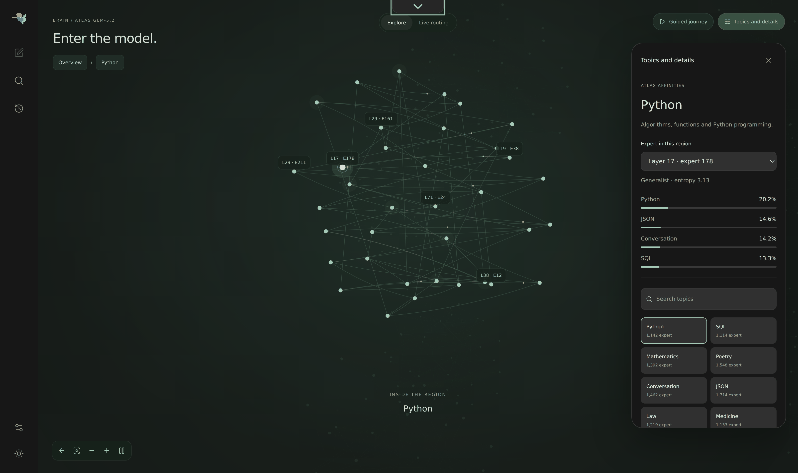

<p align="center">
  
</p>

<p align="center">
  <a href="https://justvugg.github.io/colibri"></a>
  <a href="https://github.com/JustVugg/colibri/releases"></a>
</p>

<p align="center">
  <a href="https://justvugg.github.io/colibri"><b>網站</b></a> ·
  <a href="https://discord.gg/RXV83nSZdk"><b>Discord</b></a> ·
  <a href="README.md">English</a> · <a href="README.zh-CN.md">简体中文</a> · 繁體中文 · <a href="README.it.md">Italiano</a> · <a href="README.ja.md">日本語</a>
</p>

**小巧引擎，龐大模型。**在消費級與異質硬體上執行**前沿 MoE 模型——從 744B 到
2.8T 參數**——以引擎零相依套件的純 C 實作，將儲存、RAM 與 VRAM 視為統一的推論階層。

目前可執行十個語言模型家族。這裡按引擎計數，而不是按 checkpoint：各自一個 C 檔案，
共用同一套 `coli chat` / `coli serve` / `coli web` 前端，部分引擎可執行不只一個模型。
**GLM-5.2/5.3**（744B）、**GLM-5.3-Flash**（321B，含視覺）、**Inkling**（975B）、
**Kimi K3**（2.8T）、**DeepSeek V4 Flash**（284B）、**DeepSeek V4.1 Flash**（552B，含視覺）、
**MiMo-V2.6 Flash**（309B，含視覺；同一引擎也執行 **MiMo-V2.6 Pro**，1.02T）、
**Qwen3.8-Flash-Next**（125B + 51B n-gram）、**Qwen3.6**（35B-A3B；同一引擎也執行
**Qwen3-Coder-30B-A3B** 與稠密的 **Qwen3.8-27B**，含視覺）以及 **OLMoE**（7B）。
也能生成圖像：第十一個引擎執行 **Qwen-Image-2.1**，依據文字生成圖片，`coli chat` 直接在終端機中顯示，
`coli serve` 透過 `POST /v1/images/generations` 提供（[qwen-image.md](docs/qwen-image.md)）。
[完整清單 ↓](#other-supported-models)

> **Colibrì 既是今天就能執行的推論引擎，也是一個開放的研究平台。**它的首要目標是在
> 完整的軟硬體邊界上追求推論側效能——模型格式、記憶體階層、儲存 I/O、配置、排程、核心、
> 推測解碼以及 CPU/GPU 重疊執行——讓大型模型減少對稀缺硬體的依賴，並降低執行成本。

Colibrì 將 VRAM、RAM 與儲存視為統一的多層階層，並刻意用於驗證激進的系統構想，因此
**對速度不作 SLA 承諾，對語意則給出硬性保證**：實驗必須透過可重現的端到端測量證明價值；
預設策略**絕不會在未告知的情況下改變模型精度或路由語意**。高速記憶體不足可以降低速度，
但不能悄悄重新定義模型。

```
$ ./coli chat
  🐦 colibri v1.12.1 — GLM-5.2 · 744B MoE · int4 · streaming CPU
  ✓ ready in 32s · resident 9.9 GB
  › ciao!
  ◆ Ciao! 😊 Come posso aiutarti oggi?
```

## 實際運行畫面

<p align="center">
  
</p>
<p align="center"><em>網頁儀表板（<code>./coli web</code>），1.12.0 重新設計：一個工作區，底部停靠列切換聊天、System One 模式、
Brain 頁面和效能分析，支援淺色與深色主題。圖中是 Qwen3.6 在純 CPU 機器上作答，專家從硬碟串流讀取。</em></p>

<p align="center">
  
</p>
<p align="center"><em><strong>System One 模式</strong>：同一個模型，只是不再讓它寫。給它一段文件和唯一允許的幾個答案，
它讀出每個答案的機率，不生成任何 token，並給出一個熵，說明它何時沒有把握。圖中：<strong>request changes，99.9%</strong>，
熵 0.005，讀取 4 個 token，生成 0 個。</em></p>

<p align="center">
  
</p>
<p align="center"><em><strong>大腦（Brain）</strong>頁面的 <strong>Explore</strong> 檢視：將 GLM-5.2 的<a href="https://github.com/JustVugg/colibri/issues/175">實測專家圖譜</a>繪成一塊皮質。
13,260 個已分析專家分為十個區域（Python、SQL、數學、詩歌、法律、中文……）；位置取自實測路由親和度，而非學習出的嵌入向量。
選擇一個區域即可進入。<strong>Live routing</strong> 檢視切換到正在執行的模型：每個專家一格，顏色代表儲存層級，每輪被路由到的專家都會閃白。</em></p>

<p align="center">
  
</p>
<p align="center"><em><strong>Python</strong> 區域內部：1,142 個專家組成的星座，每個都標註了層號和序號。面板顯示其中一個：第 17 層第 178 號專家，
一個熵為 3.13 的通才，其實測親和度為 Python 20.2%、JSON 14.6%、對話 14.2%、SQL 13.3%。</em></p>

<p align="center">
  
</p>
<p align="center"><em><strong>效能剖析（Profiling）</strong>頁面：引擎在每一輪中的時間去向，按階段劃分，並以最近 30 輪作為趨勢。
此處為 CPU 機器上的 Qwen3.6：36 個提示詞元與 55 個生成詞元共用時 19.0 秒，2.9 tok/s，其中 11.4 秒的磁碟服務與計算重疊。</em></p>

## 研究使命

有了 Colibrì，私有部署的前沿模型不再受限於能否取得超大規模雲端業者等級的硬體。

憑藉多層階層（multitiering）特性，Colibrì **透過積極最佳化推論引擎的各條功能管線，消除對專有硬體的依賴**。

我們的具體使命包括：改變權重的表示與移動方式，決定哪些內容常駐 VRAM、RAM 或儲存，重疊異質運算，
降低啟動與同步開銷，利用稀疏性與重用，並驗證新的解碼演算法。傳統做法不是免責理由，
微基準快也不是採用理由；最終依據是在真實機器上的端到端推論，同時測量正確性、品質、
吞吐、延遲、記憶體與成本。

它帶來的實際結果是**可及性**：在既有硬體上執行 744B 模型，即時觀察每個專家，並直接修改實作。
不是從 API 租用智慧，而是*持有*它：探測、測量和改進它。引擎刻意維持足夠小，讓任何願意測量
的人都可能貢獻下一項有效最佳化。

## 核心技術與實測結論

- **統一階層，不受單一層級容量限制。**VRAM、RAM 與 NVMe 是同一份權重的不同配置階層；
  高速記憶體不足只影響速度，不改變模型語意。
- **權重的 JIT。**實測路由熱度驅動逐層 LRU、學習型熱門專家固定區和提前一層的預先載入，
  無需載入所有專家。它在可重複負載上有收益，但歷史可能過度擬合，預先載入在部分主機上
  也可能負最佳化，因此它們是需要測量的策略，不是效能承諾。
- **I/O 本身就是引擎的一部分。**專家批次聯集、讀算重疊、`O_DIRECT` 與加權雙 SSD
  分流直接最佳化串流路徑，而不是假裝儲存延遲不存在。`O_DIRECT` 取決於磁碟，雙 SSD
  仍需要更多社群端到端 A/B。
- **異質執行。**CPU、CUDA、Metal、NUMA 記憶體以及專家的部分或全部常駐共用一個執行環境，
  可依機器條件組合；最佳組合取決於算力、頻寬、常駐率與負載。
- **壓縮狀態，不竄改模型。**逐 token 精確的前向驗證、縮小 57 倍的 MLA KV 狀態、
  持久化熱會話與忠實 DSA，讓最佳化始終受正確性約束。這些是記憶體、延遲和正確性屬性，
  不是籠統的吞吐承諾。
- **必須證明收益的推測解碼。**原生 MTP 與文法強制草稿均接受端到端測量；
  接受率無法覆蓋驗證成本時可以關閉。

## 開放猜想、實驗與參與方式

在受控的端到端 A/B 證明之前，Colibrì 將每項最佳化都視為猜想。目前主要問題如下：

| 猜想 | 目前證據 | 仍需完成的實驗 |
|---|---|---|
| 路由歷史能比普通 LRU 更好地配置專家 | 學習型固定區能改善重複負載，但也會對 prompt 過度擬合 | 在程式碼、對話、多語言和長上下文負載上做留出集、跨會話 A/B |
| 多顆 SSD 能將獨立頻寬轉化為解碼速度 | 兩顆獨立 NVMe 實測解碼 +37.5%；經加權分流後，較慢的第三顆硬碟影響持平（[測量數據](docs/multidisk.md#what-has-been-measured)） | 在不同硬碟速度、控制器配置與快取狀態下重現 |
| 硬體感知規劃器能自動接近每台機器的最佳配置 | 目前已偵測 RAM/VRAM 預算與多個後端 | 將自動方案與參數掃描對比，涵蓋筆電、工作站、NUMA 和多 GPU 主機 |
| 無損或品質受控的表示能充分減少權重搬運 | 已有格式與量化消融，並設置正確性／品質門檻 | 同時重現品質、搬運位元組、延遲和每個有效 token 成本，而非只看壓縮率 |
| 路由感知推測能在接近全常駐前獲利 | MTP 與文法草稿可用，但 MTP 在約 85% expert hit 時也實測過 -32% | 繪製接受率、命中率、批次聯集與草稿深度的盈虧邊界 |
| CPU/GPU 重疊能隱藏傳輸與同步，而非僅轉移瓶頸 | CUDA 與 Metal 有成功數據，但強 CPU 和低常駐率會抹平收益 | 在 PCIe、統一記憶體與全常駐機器上做逐階段 profile 和單變數 A/B |

想參與就任選一行，負結果也請公開。請記錄硬體、commit、模型容器、完整指令、prompt、
快取狀態、吞吐、TTFT、expert hit、讀取位元組數與品質檢查；每次只改一個變數，重複執行並附上
原始日誌。先閱讀 [CONTRIBUTING.md](CONTRIBUTING.md)，對照
[benchmark 協議](docs/benchmarking.md)，然後
[建立實驗 issue](https://github.com/JustVugg/colibri/issues/new)。
在這裡，一個受控的失敗比一個無法解釋的高數字更有價值。

## 核心概念

744B 的專家混合（Mixture-of-Experts）模型，每個 token 只會啟用約 40B 參數——
其中每個 token 之間會變動的只有約 11 GB（被路由到的專家）：

<p align="center">
  
</p>

所以模型不必完整**放進**高速記憶體，而是需要正確**配置位置**：

- **稠密部分**（注意力、共享專家、嵌入——約 17B 參數）以 int4
  **常駐 RAM**（約 9.9 GB）；
- **19,456 個路由專家**（75 個 MoE 層 × 256，加上 MTP head；每個在 int4 下約 19 MB）
  **存放在硬碟**（約 370 GB），並**隨需串流載入**，搭配逐層 LRU 快取、
  會學習的熱門專家固定儲存區，以及選用的 VRAM 層級。

可以把核心演算法理解為**權重的 JIT**。編譯器的 JIT 從不編譯整個程式：它觀察實際執行的部分，
及時編譯熱點路徑。colibrì 對 744B 的參數空間下了同樣的賭注：參數不是需要一直持有的常駐狀態，
而是**需要分級調度的資料**，在路由器證明需要它們的那一刻，於異質儲存階層（VRAM / RAM / NVMe）
之間就位。實測路由熱度決定哪些專家進入哪一層級，路由器提前一層執行，讓預先載入隱藏調度延遲；
而且像 JIT 一樣，引擎會學習你的工作負載：執行得越多，正確的專家就越熱。之所以可行，是因為
路由具有可測量的結構（見[專家圖譜](https://github.com/JustVugg/colibri/issues/175)），
而結構是可以快取的。

引擎由主 C 檔（`c/colibri.c`）與多個標頭檔模組組成。不需要 BLAS，
執行階段不需要 Python，也不需要 GPU。

### 本機叢集模式

協調節點（coordinator）在本機保留 token 生成、路由與 KV 狀態，而以硬碟為後端的專家 worker
在其他 Mac 上執行被路由的 FFN。一層的路由批次聯集以一個持久 TCP 請求傳送，因此一個 token
不會為每個專家各付出一次往返。

啟動選用的註冊服務：

```bash
./coli cluster coordinator --host 0.0.0.0 --port 8765
```

在每個 worker 上，本機需有同一個已轉換的模型：

```bash
./coli cluster worker --model /nvme/glm52_i4 --port 9100 \
  --coordinator http://COORDINATOR:8765 --advertise-host WORKER_IP
```

以探索模式執行協調節點，或為靜態部署提供 `--cluster-workers
HOST:PORT,...`：

```bash
./coli serve --model /nvme/glm52_i4 \
  --cluster-coordinator http://127.0.0.1:8765
```

除非設定了 worker，否則傳輸層保持關閉，現有的單機路徑不受影響。稠密層分片與
瀏覽器／WebGPU worker 是另行跟進的擴充點。

## 運作方式

### 每個 token 的處理路徑

<p align="center">
  
</p>

每個 token 的每一層都會走過相同的五個步驟。設計目標是讓
**配置只決定速度**——無論專家是從 VRAM 或硬碟回應，路由器的決策與權重精度都完全相同。

### 統一記憶體階層，取代單一記憶體門檻

<p align="center">
  
</p>

<a id="dual-ssd-two-copies-of-the-model-twice-the-read-bandwidth"></a>

### 多顆 SSD：從不只一顆硬碟串流讀取模型副本

當解碼受硬碟限制時，**第二顆 SSD** 會有幫助：在上面放一份模型副本，讓引擎同時從兩顆硬碟讀取。
以 GLM-5.2 為例，在原始碼 checkout 的 `c/` 目錄下（或在解壓後的發布套件中）：

```bash
COLI_MODEL_MIRROR=/second/glm52_i4 python3 ./coli chat --model /fast/glm52_i4
```

引擎會在啟動時測量各顆硬碟，以決定讀取分配的權重。緩衝讀取採用確定性的專家路由；符合條件的
直接讀取可以把一個專家條帶化分布到多個副本上。獨立的硬碟提供的是頻寬餘裕，而不是有保證的
token 速率倍數：共用控制器、快取命中與運算都可能限制收益。Bash 與 PowerShell 範例、實測收益
與限制，以及與單碟的對比，請見[多磁碟指南](docs/multidisk.md)。值得了解的細節：

- 鏡像會在**啟動時驗證**（每個檔案的大小與 safetensors 標頭必須與主副本逐位元組一致）；不一致或缺少的檔案仍由主副本提供，因此**部分鏡像也可以**：較小的第二顆 SSD 可以提供它所持有的 shard；
- 鏡像**從不寫入**：`.coli_usage`、`.coli_kv` 與所有 sidecar 都保留在主副本上；
- 鏡像讀取出錯時會退回主副本（一條警告，不會當機），因此執行中拔掉第二顆硬碟只會降級，不會讓伺服器結束；
- 路由從不改變 token：兩份副本逐位元組相同；啟用 `PROF=1` 可看到 `MIRROR:` 效能計數器，顯示每顆硬碟提供了多少 GB。

同一套引擎涵蓋完整硬體範圍：在 25 GB 筆電上，一切都從硬碟串流載入
（慢，但結果正確）；在大型主機上，則可讓整組專家常駐
（`CUDA_EXPERT_GB=auto PIN_GB=all`），讓硬碟完全退出解碼路徑。
兩端之間有一層**學習型快取**：引擎會記錄*你的*工作負載路由到哪些專家
（`.coli_usage`，每輪更新），並自動固定最熱門的專家——colibrì 確實會越用越快。
在多插槽主機上，`COLI_NUMA=1` 會將常駐權重交錯分配到各記憶體控制器
（[#82](https://github.com/JustVugg/colibri/issues/82)）。

對於放不下整個模型的第二顆硬碟，Colibri 可以根據它已經學到的專家歷史，為部分鏡像排序。
先執行幾個有代表性的 prompt，讓 `.coli_usage` 反映實際負載，然後規劃、暫存並驗證鏡像：

```bash
./c/coli mirror plan  --model /fast/glm52_i4 --mirror /second/glm52_i4 \
  --budget-gib 200 --reserve-gib 20
./c/coli mirror stage --model /fast/glm52_i4 --mirror /second/glm52_i4 \
  --budget-gib 200 --reserve-gib 20
./c/coli mirror verify --model /fast/glm52_i4 --mirror /second/glm52_i4
```

規劃器直接讀取 safetensors 標頭，依循 `COLI_MODEL_DIRS` 中的分割模型目錄，並優先選擇能服務
最熱路由專家的 shard。暫存從不改動主模型：它透過暫存檔複製，保留所要求的剩餘空間，
以 SHA-256 驗證每個 shard，從不刪除既有的鏡像 shard，並且只在所選鏡像就緒後才以不可分割
（atomic）的方式發布回執。

### 絕不為同一次硬碟讀取等待兩遍

快取未命中的成本很高，因此引擎大部分的巧思都用來避免或重疊處理這些讀取：
每個專家的三個矩陣相鄰儲存，並以一次 `pread` 讀取；有界非同步 I/O pool
（`PIPE=1`，預設啟用）會在常駐專家運算時載入缺少的專家；批次位置只讀取每個
不重複專家一次（**批次聯集**）；路由前瞻執行緒（`PILOT=1`）則預先載入下一層專家——
實測顯示，路由結果提前一層時有 **71.6% 的可預測性**。
在 GPU 上，常駐管線（`COLI_CUDA_PIPE=2`）讓殘差流跨層保留在裝置端，
使 CPU 專家迴圈不中斷；在 Apple Silicon 上，實驗性的
[Metal 後端](docs/metal.md)會用統一記憶體 GPU 執行批次專家運算；
[Vulkan 後端](docs/vulkan.md)則把專家層級、稠密投影與 MLA 注意力核心帶到任何具有
Vulkan 1.2 驅動程式的 GPU 上，包括透過 Mesa/RADV 的 AMD 顯示卡（對於廠商軟體堆疊已不再支援的
顯示卡，例如 RX 580，它是唯一的後端；在 RDNA4 上與 ROCm 不相上下，請見[基準測試說明](docs/vulkan.md)）。
其餘所有引擎現在也會在 `VK=1` 建置中透過 `COLI_VULKAN=1` 使用同一後端放置常駐矩陣；
CI 會將其與 CPU 的 token 對照檢查，但在它們首次實測的真實 GPU（內建顯示晶片 Radeon 780M）上，
目前比 CPU 慢（[其他引擎](docs/vulkan.md#the-other-engines)）。

> **在真實 NVMe 上，請實測 `DIRECT=1`。** O_DIRECT 繞過頁面快取，在帶 DRAM 快取且頻寬有餘裕
> 的硬碟上往往有顯著收益（在一台 Blackwell/Windows 機器上搭配 `PIPE=1` 實測解碼 +34%；
> 在 GB10 上 iobench 為 4.25→9.69 GB/s），但它取決於硬碟：QLC／無 DRAM 或虛擬化的磁碟
> 可能沒有收益甚至變慢。先試一試，保留你的硬體真正受益的設定。

### 忠實模型，壓縮狀態

前向傳遞已透過 `transformers` oracle 驗證（teacher-forcing 通常為
30-32/32；tiny oracle 中有兩個位置是浮點數近似平手，結果會受工具鏈影響）。
MLA 注意力儲存壓縮後的 KV 狀態——每個 token 為 576 個浮點數，而非 32,768 個
（**縮小 57×**）——並跨重新啟動持久保存
（`.coli_kv`）：對話可暖啟恢復，不需重新 prefill，結果與不中斷的工作階段
逐位元組相同。DSA 稀疏注意力（GLM-5.2 的 lightning indexer）已忠實實作，
並透過強制選取所有 key，驗證可精確重現稠密注意力。

### 如實呈現推測式解碼

GLM-5.2 原生 MTP head 會起草 token，再由主模型以一次批次前向傳遞驗證——
條件合適時每次 forward 可產生 2.2–2.8 個 token。兩條得來不易的規則已成為預設值：
MTP head 必須是 **int8**（int4 head 的接受率會崩落到 0–4%，見
[#8](https://github.com/JustVugg/colibri/issues/8)），且草稿與驗證必須計算
**相同函數**——`SPEC_PIN=1` 會把兩者固定在同一 kernel family
（完整鑑識過程見 [#163](https://github.com/JustVugg/colibri/issues/163)）。
文法強制草稿（[`GRAMMAR=file.gbnf`](docs/grammar-draft.md)）可在受限 JSON 輸出中，
以近乎免費的成本提高接受率。推測式解碼是否帶來淨收益取決於快取熱度——請實測，
若不划算就使用 `DRAFT=0`。

驗證批次還可以透過 `COLI_EXACT_VERIFY=1` 選用**精確注意力核心**
（[#689](https://github.com/JustVugg/colibri/issues/689)）：CPU 上 MLA-absorb 的 score 與
context 內積改為累加整數乘積並只捨入一次，因此驗證列中的近似平手在每台主機上都會得到相同的
結果；在 tiny oracle 上速度約為 0.6x tok/s（內積本身約為浮點迴圈的 5–7x）。需要了解兩點
限制：使用量化 KV 快取（`tq1`、TQ 或 int8 KV）時，context 內積仍走浮點路徑，因此那裡不提供
精確性；而真正的近似平手翻轉目前只是推論，尚未在 GLM-5.2 的 n=64 上實際捕捉到。

## 實際成果

<p align="center">
  
</p>

同一套引擎、同一個 int4 容器——硬體只會改變專家的存放位置。
[完整 benchmark 表格](docs/benchmarks.md)中的重點如下：

- **6× RTX 5090，全部常駐：**解碼 5.8–6.8 tok/s，TTFT 約 13 秒
  （[實驗紀錄](docs/experiments/glm52-6x5090-2026-07-12.md)）；
- **128 GB、僅使用 CPU 的桌上型電腦：**暖機後約 1.8 tok/s
  （[#200](https://github.com/JustVugg/colibri/issues/200)）；
- **單張 RTX 5070 Ti 的筆電級電腦：**透過 GPU 常駐管線達到 1.07 tok/s
  （[#273](https://github.com/JustVugg/colibri/issues/273)）；
- **25 GB 開發機：**冷啟動 0.05–0.1 tok/s——這是專案起步時已證實的下限，
  也仍是如實呈現的基準。

品質來自測量，而非假設：int4 容器的量化成本，以及 scale granularity／rotation
消融實驗，收錄於 [docs/benchmarks.md](docs/benchmarks.md#quality-benchmark)、
[#108](https://github.com/JustVugg/colibri/issues/108) 與
[#81](https://github.com/JustVugg/colibri/issues/81)。

## 開始使用

你需要兩樣東西：**程式本體**（幾百 KB）與**模型**（372 GB）。各平台的逐步
指引請見 [Quick Start 指南](docs/quickstart.md)。

### 一步完成

**Windows：** 下載儲存庫（**Code** 中的 **Download ZIP**，或 `git clone`），解壓縮後
雙擊 **`START-HERE.bat`**。
**Linux 與 macOS：**

```bash
git clone https://github.com/JustVugg/colibri && cd colibri
./start-here.sh
```

它會偵測記憶體、磁碟與 GPU，推薦一個適合這台機器的模型（按 Enter 即採用推薦），在
GPU 可用時以 Vulkan 或 CUDA 編譯引擎（或取得預先編譯的版本），以可續傳的方式下載模型
（隨時可以中斷，再次執行即從中斷處繼續），並在瀏覽器中開啟儀表板。它也會印出供其他
應用程式使用的 OpenAI 與 Anthropic 基礎 URL。之後再次執行，colibri 會直接啟動；
`c/coli stop` 可以停止它。每一步做什麼：[quickstart.md](docs/quickstart.md#the-one-step-way)。

在用 AI 程式設計助手嗎？請它依照 [docs/AI_SETUP.md](docs/AI_SETUP.md) 安裝 colibri。
支援 Model Context Protocol 的助手可以使用 `coli mcp`
（[MCP_SERVER.md](docs/MCP_SERVER.md)）。

以下是手動安裝的步驟。

### 1. 取得 colibri

**下載預先建置的版本**——Linux、macOS 與 Windows 均已提供，不需要編譯器。從
[Releases](https://github.com/JustVugg/colibri/releases) 下載對應平台的壓縮檔並解壓：

```bash
mkdir colibri && tar xzf colibri-v1.8.0-linux-x86_64.tar.gz -C colibri && cd colibri
python3 coli info                         # engine ready ✓
```

裡面包含引擎（`colibri`，Windows 上為 `colibri.exe`）、`coli` 啟動器及其 Python
輔助腳本。不需重新命名或設定：`coli` 會自動找到同目錄下的引擎。你只需安裝
[Python 3](https://www.python.org/downloads/)——啟動器與 API gateway 是 Python
腳本，而引擎本身是零相依的純 C 程式。

**或者從原始碼建置**——需要具備 OpenMP 的 `gcc`（或 clang）：

```bash
git clone https://github.com/JustVugg/colibri && cd colibri/c
./setup.sh                                # 檢查 gcc/OpenMP、建置並執行自我測試
```

想把 `coli` 加入 PATH？在 checkout 中執行 `pip install -e .` 即可註冊（引擎仍位於
`c/` 目錄——這是從複製目錄做的可編輯安裝，而非獨立 wheel）。

### 2. 取得模型

Hugging Face 上已有預先轉換的 **GLM-5.2 int4** 容器——請務必使用
**含 int8 MTP head 的 group-scaled（gs64）版本**。它約為 **372 GB**，請放在空間足夠的硬碟上，最好是快碟：

**https://huggingface.co/mastouri/GLM-5.2-colibri-int4-g64-with-int8-mtp**

**GLM-5.3** 屬於同一家族，使用同一引擎載入。它有自己的 group-scaled（gs64）容器，
約 **419 GB**，且**不含** MTP head，因此推測解碼保持關閉：

**https://huggingface.co/Justvugg/GLM-5.3-colibri-int4-g64**

> ⚠️ 請使用上面的 **gs64** 容器，不要使用較舊的 per-row int4 鏡像
>（`mateogrgic/…`、`jlnsrk/…`）：後者品質實測低約 9 個百分點，也是
> [#455](https://github.com/JustVugg/colibri/issues/455) 最初 think-mode 迴圈與生成不終止的根因。
> gs64 修復了受控的 per-row A/B 問題，但不是通用的重複或 EOS starvation 防護。
> MTP head 也必須是 **int8，而非 int4**（int4 的草稿接受率為 0%，
> [#8](https://github.com/JustVugg/colibri/issues/8)）：
> `ls -l <model>/out-mtp-*`：正確的 int8 是三個檔案，大小為 `3527131672 / 5366238584 / 1065950496`，
> 或單一 `out-mtp-00000.safetensors`，大小為 `9959321520` 位元組（推薦容器目前的上傳版本就是單一檔案：
> 同樣的 int8 張量，共 777 個，每個元素一個位元組）。

你也可以自行從 FP8 來源轉換——只需一條可續傳的指令，且任何時候都不需要
在硬碟上同時存放完整的 756 GB：

```bash
./coli convert --model /nvme/glm52_i4     # 逐 shard 下載並轉換（僅此一次需要 python）
```

<a id="other-supported-models"></a>
#### 其他支援的模型

GLM-5.2 是參考模型，但同樣的串流方法還能執行另外九個語言模型家族，另有一個引擎用於生成圖像。
每個都是一個**同級引擎**：一個 C 檔案、自己的架構、同一套 `coli chat` / `coli serve` /
`coli web` 前端（啟動器根據模型的 `config.json` 選擇二進位檔，圖像模型則根據
`model_index.json`）：

> **各自需要什麼。** 這些模型差別很大，有人把其中兩個放在一起讀，誤以為要求互相矛盾
> （[#191](https://github.com/JustVugg/colibri/issues/191)）。它們並不矛盾，只是不同的模型。
> **它們都不需要 GPU。**
>
> | 模型 | 權重所需硬碟空間 | RAM | GPU |
> |---|---|---|---|
> | **OLMoE** | 約 7 GB（int8 容器） | 8 GB | 不需要；可選用 Vulkan |
> | **GLM-5.2/5.3** | 約 372 GB（5.2）／約 419 GB（5.3） | 最低 16 GB，舒適 24 GB | 不需要；可選用 Vulkan |
> | **GLM-5.3-Flash** | 轉換後約 195 GB | 25 GB（int4 權重 12 GB + 專家快取） | 不需要；可選用 Vulkan |
> | **Inkling** | 約 469 GB | 使用 int4 稠密容器時 25 GB，不使用時約 120 GB | 不需要；可選用 Vulkan |
> | **Kimi K3** | 約 1.6 TB | 32 GB 以上 | 不需要；可選用 Vulkan |
> | **DeepSeek V4 Flash** | 約 167 GB（REAP 150B：約 85 GB） | 最低 16 GB，舒適 32 GB | 選用；GTX 10 系列以上的任何 NVIDIA 顯示卡（Pascal/Turing 透過 `CUDA_ARCH=portable-pre-ampere NO_TC=1`，RTX 50 上效果最佳）可使 prefill 快 5-10 倍、解碼快約 2.5 倍；可選用 Vulkan |
> | **DeepSeek V4.1 Flash** | 約 510 GB（官方 checkpoint；其中 203 GB 是每次只讀取幾百位元組的 n-gram 記憶） | 約 18 GB 常駐（稠密部分、嵌入、視覺），加上由 `--ram` 決定大小的專家快取；cap 8 時實測峰值 RSS 24.8 GB | 不需要；可選用 Vulkan |
> | **MiMo-V2.6 Flash** | 約 178 GB（官方 checkpoint） | 每層快取 32 個專家時實測常駐 30.1 GB，64 個時 49.8 GB；快取大小由 `--ram` 決定 | 不需要；可選用 Vulkan |
> | **MiMo-V2.6 Pro** | 約 574 GB（不含引擎從不載入的三個檔案時約 564 GB） | 稠密部分按發布格式為 30.2 GiB，int8 下為 21.7 GiB；每層快取 12 個專家時實測常駐 48.0 GB（稠密部分按發布格式），20 個時 50.7 GB（稠密部分為 int8） | 不需要；可選用 Vulkan |
> | **Qwen3.8-Flash-Next** | 約 185.5 GB（官方 FP8 checkpoint），選用的 int4-g64 專家 sidecar 另需 68.0 GB | 使用 FP8 專家、預設上下文時舒適為 24 GB（cap 32；16 GB 低於下限）；使用 int4-g64 sidecar 時 cap 32 實測 RSS 11.6 GB | 選用；CUDA VRAM 專家層級（僅限 FP8 專家），稠密主幹在 VRAM 中量化為 int8；可選用 Vulkan |
> | **Qwen3.8-27B**（稠密，文字與圖像） | 轉換後約 51 GB（f16） | 稠密權重為 int4 時 20 GB，int8 時 30 GB | 不需要；尚無 CUDA 層級；可選用 Vulkan |
> | **Qwen3.6-35B-A3B** | 約 20 GB（int4-gs64 容器） | 24 GB（需要完全常駐 RAM） | 選用；CUDA VRAM 專家層級在兩張 8 GB 顯示卡上實測 **1.44 -> 10.05 tok/s（7.0x）**，輸出與 CPU 逐位元一致；可選用 Vulkan |
> | **Qwen3-Coder-30B-A3B** | 約 19 GB（int4-gs64 容器；int8 為 30 GB） | 每層快取 32 個專家時實測常駐 6.5 GB，全部 128 個時 15.2 GB | 不需要；可選用 Vulkan |
> | **Qwen-Image-2.1**（文字生成圖像） | 約 33 GB（官方 diffusers checkpoint） | 全部常駐 16.0 GB；每個 prompt 載入文字編碼器時峰值 8.5 GB，另加工作緩衝區（生成一張 768x512 圖像實測峰值 9.0 GB） | 不需要；可選用 Vulkan，尚未在 GPU 上計時 |
>
> GPU 從不改變模型的回答，只改變運算在哪裡進行。速度由你的硬碟決定，因為專家是從硬碟
> 串流讀取的：慢速硬碟上每秒不到一個 token，快速硬碟在快取預熱後每秒幾個 token。
>
> **可選用 Vulkan** 指的是 `VK=1` 建置。以 `COLI_VULKAN=1` 執行時，引擎會把常駐矩陣放到任何
> 具有 Vulkan 1.2 驅動程式的 GPU 上（GLM-5.2 在那裡有完整的解碼路徑），CI 在軟體驅動程式上將
> 這些引擎與 CPU 的 token 對照檢查
> （[vulkan.md](docs/vulkan.md#the-other-engines)）。正確還不等於更快。在這些引擎首次實測的
> 真實 GPU，即內建顯示晶片 Radeon 780M（Ryzen 7 PRO 8700GE，同樣的二進位檔，冷頁面快取）上，
> 目前比 CPU 慢：Qwen3.6-35B-A3B 解碼 3.06 tok/s，CPU 為 5.97，輸出完全相同；使用 int4 專家的
> Qwen3.8-Flash-Next 為 1.53，CPU 為 3.55。每次矩陣乘法都是一次同步提交，每個 token 約 726 次，
> 而內建顯示晶片讀取的是與 CPU 相同的 RAM。

| 家族 | 總參數 / 啟用參數 | 權重 | 建置 | 文件 |
|---|---|---|---|---|
| **GLM-5.2/5.3** | 744B / 40B | [`mastouri/…-int4-g64-with-int8-mtp`](https://huggingface.co/mastouri/GLM-5.2-colibri-int4-g64-with-int8-mtp)（372 GB）或 [`Justvugg/GLM-5.3-colibri-int4-g64`](https://huggingface.co/Justvugg/GLM-5.3-colibri-int4-g64)（419 GB） | `make -C c glm` | 本頁 |
| **Inkling**（Thinking Machines） | 975B / 41B | [`nbeerbower/Inkling-colibri-int4`](https://huggingface.co/nbeerbower/Inkling-colibri-int4)（469 GB） | `make -C c inkling` | [inkling.md](docs/inkling.md) |
| **GLM-5.3-Flash**（Z.ai） | 321B / 18B | [`zai-org/GLM-5.3-Flash`](https://huggingface.co/zai-org/GLM-5.3-Flash)，路由專家轉換為 **int4-gs64**，稠密部分保持 BF16，精度在載入時選擇；含視覺 | `make -C c glm53` | [glm53-flash.md](docs/glm53-flash.md) |
| **Kimi K3**（Moonshot） | 2.8T / 104B | [`moonshotai/Kimi-K3`](https://huggingface.co/moonshotai/Kimi-K3)，原始 checkpoint，路由專家保持**原生 MXFP4** | `make -C c kimi_k3` | [kimi_k3.md](docs/kimi_k3.md) |
| **DeepSeek V4 Flash** | 284B / 13B | 官方分片 checkpoint，路由專家保持**原生 fp4**，稠密部分保持 fp8-e4m3；**REAP 剪枝的 150B**（[`puwaer/DeepSeek-V4-Flash-0731-reap-150b`](https://huggingface.co/puwaer/DeepSeek-V4-Flash-0731-reap-150b)，85 GB，256 個專家中保留 132 個）用同一引擎載入，無需轉換 | `make -C c deepseek-v4` | [deepseek-v4.md](docs/deepseek-v4.md) |
| **DeepSeek V4.1 Flash** | 552B / 16B | 官方 checkpoint，**無需轉換**：專家本身已是 fp4，稠密部分為 fp8-e4m3。其中 203 GB 是每次只從硬碟讀取幾百位元組的 n-gram 記憶，路由專家**每個 token 4.5 GB**，而 GLM-5.2 為 12.7 GB。視覺、工具呼叫與 DSpark 草稿 head 全部啟用 | `make -C c deepseek_v41` | [deepseek-v41.md](docs/deepseek-v41.md) |
| **MiMo-V2.6 Flash**（Xiaomi） | 309B / 15B | [`XiaomiMiMo/MiMo-V2.6-Flash-MOPD`](https://huggingface.co/XiaomiMiMo/MiMo-V2.6-Flash-MOPD)（178 GB），官方 checkpoint，**無需轉換**：路由專家保持**原生 MXFP4**，稠密部分保持 FP8/BF16。48 層中有 39 層只關注 128 個 token 的視窗，因此長上下文只需 9 層的 KV。支援視覺與工具呼叫 | `make -C c mimo` | [mimo.md](docs/mimo.md) |
| **MiMo-V2.6 Pro**（Xiaomi） | 1.02T / 42B | [`XiaomiMiMo/MiMo-V2.6-Pro-MOPD`](https://huggingface.co/XiaomiMiMo/MiMo-V2.6-Pro-MOPD)（573.5 GB），官方 checkpoint，**無需轉換**，執行在 MiMo 引擎上：同一架構，70 層、384 個專家。已在 70 層中的前 32 層上與 Xiaomi 自己的建模程式碼對照驗證。支援視覺與工具呼叫 | `make -C c mimo` | [mimo.md](docs/mimo.md#pro) |
| **Qwen3.8-Flash-Next**（Alibaba） | 125B + 51B n-gram / 6B | [`Qwen/Qwen3.8-Flash-Next-FP8`](https://huggingface.co/Qwen/Qwen3.8-Flash-Next-FP8)，原始 checkpoint；PLE 保持可分頁，專家保持**原生 block-FP8**，或從選用的 sidecar 以 **int4-g64** 讀取（見下文）。可選用 MTP 草稿（`Q38_MTP=1`） | `make -C c qwen38`（VRAM 專家層級需 `CUDA=1`） | [qwen38.md](docs/qwen38.md) |
| **Qwen3.6**（Alibaba） | 35B / 3B | [`Kreuzzelg/qwen36-35b-a3b-colibri-i4-gs64`](https://huggingface.co/Kreuzzelg/qwen36-35b-a3b-colibri-i4-gs64)（約 20 GB，**推薦**），Gated Attention + Gated DeltaNet 混合架構 | `make -C c qwen36`（VRAM 專家層級需 `CUDA=1`） | [qwen36.md](docs/qwen36.md) |
| **Qwen3.8-27B**（Alibaba） | 27B，稠密 | 以 `c/tools/convert_qwen36.py` 將 [`Qwen/Qwen3.8-27B`](https://huggingface.co/Qwen/Qwen3.8-27B) 轉換為 f16 容器（51 GB）；引擎在載入時將其量化為 int8，設定 `COLI_DENSE_BITS=4` 時量化為 int4。每層一個 MLP，沒有路由器，執行在 Qwen3.6 引擎上。支援文字與圖像 | `make -C c qwen36` | [qwen36.md](docs/qwen36.md#the-dense-27b) |
| **Qwen3-Coder-30B-A3B**（Alibaba） | 30B / 3B | [`Justvugg/Qwen3-Coder-30B-A3B-colibri-int4`](https://huggingface.co/Justvugg/Qwen3-Coder-30B-A3B-colibri-int4)（19 GB，int4-gs64），由 [`Qwen/Qwen3-Coder-30B-A3B-Instruct`](https://huggingface.co/Qwen/Qwen3-Coder-30B-A3B-Instruct) 轉換而來。執行在 Qwen3.6 引擎上的全注意力 Qwen3 MoE，128 個專家 top-8，有自己的 XML 工具呼叫格式，不帶思考；在 teacher forcing 下，int4 容器在 96.9% 的位置上選出與 bf16 發布版相同的 top-1 token | `make -C c qwen36` | [qwen36.md](docs/qwen36.md#qwen3-coder-30b-a3b) |
| **OLMoE**（AI2） | 7B / 1B | 以 `c/tools/convert_olmoe_merged.py` 轉換，**int8** 容器，約 7 GB | `make -C c olmoe` | 無 |
| **Qwen-Image-2.1**（Alibaba） | 圖像模型 | [`Qwen/Qwen-Image-2.1`](https://huggingface.co/Qwen/Qwen-Image-2.1)（約 33 GB），官方 diffusers checkpoint，**無需轉換**：文字編碼器與擴散 transformer 在載入時量化為 int8。`coli chat` 中直接顯示圖片，`coli serve` 提供 `POST /v1/images/generations`。Qwen Research License：僅限非商業用途 | `make -C c qwenimage` | [qwen-image.md](docs/qwen-image.md) |
| **Laya**（Convai Innovations） | 決策模型，421M | [`convaiinnovations/laya`](https://huggingface.co/convaiinnovations/laya)（842 MB），官方 checkpoint，**無需轉換**：ModernBERT 編碼器加決策頭，對型別化問題（choice、score、noul）給出校準後的機率，而不是生成文字。由 `coli serve` 在 `POST /v1/systemone` 上提供。Apache-2.0 | `make -C c laya` | [laya.md](docs/laya.md) |
| **GLiNER2.5-Decide**（fastino） | 決策模型，340M | [`fastino/GLiNER2.5-Decide`](https://huggingface.co/fastino/GLiNER2.5-Decide)（1.9 GB），官方 checkpoint，**無需轉換**：DeBERTa-v3 編碼器加 GLiNER2 的分類頭，一次讀完請求中的所有問題和狀態，為每個選項給出機率。由 `coli serve` 在 `POST /v1/systemone` 上提供。Apache-2.0 | `make -C c gliner_decide` | [gliner_decide.md](docs/gliner_decide.md) |

Qwen3.6 提供三個預先轉換的容器：**int4-gs64**（推薦：與 per-row 相比，對 int8 基準的餘弦相似度
實測從 0.98777 提升到 0.99313，KL 從 0.109 降到 0.080，即量化誤差減少約 44%）、作為 A/B 基準的
[int4 per-row](https://huggingface.co/Kreuzzelg/qwen36-35b-a3b-colibri-i4)，以及
[KAT-Coder v2.5](https://huggingface.co/Kreuzzelg/kat-coder-v2.5-dev-colibri-i4-gs64)，同一引擎可以
直接執行它：任何架構相同的 checkpoint 都無需專屬的程式碼路徑。使用 `CUDA=1` 時，VRAM 專家層級
**在兩張 8 GB 顯示卡上實測 1.44 → 10.05 tok/s（7.0×）**，輸出與 CPU 路徑逐位元一致。

Qwen3.8-Flash-Next 按發布格式以 block-FP8 讀取路由專家。選用的 **int4-g64 sidecar**
（`c/tools/convert_qwen38_experts_int4.py`，在 FP8 shard 旁寫入 68.0 GB）讓每次未命中只讀取
56% 的位元組。在 Ryzen 7 PRO 8700GE（16 執行緒，61 GiB，NVMe）上實測，相同快取大小下解碼快
1.4-1.5 倍，相同 RAM 下快 1.56 倍，困惑度平均每個 token 增加 +0.017 nats
（[qwen38.md](docs/qwen38.md#routed-experts-as-int4-g64)）。使用 checkpoint 內建 MTP head 的
推測解碼為選用功能（`Q38_MTP=1`），輸出與一般解碼完全相同。在同一台機器上使用 int4 專家時，
94-96% 的草稿被接受，每次前向傳遞 1.94 個 token，tok/s 提升 +12-14%（cap 96 時從 3.57 到 4.01，
cap 170 時從 4.15 到 4.74）。在那台機器上收益不大，因為從硬碟讀取專家的量並沒有減少
（[qwen38.md](docs/qwen38.md)）。

Kimi K3 無需轉換：其 QAT 訓練的 MXFP4 專家直接從原始 Hugging Face shard 串流讀取，bf16 稠密部分
在載入時量化。長時間的 agent 工作階段可以選用循環狀態檢查點（RAM 中 `COLI_K3_CKPT=N` 個 slot，或用
`COLI_K3_CKPT_DIR` 存到硬碟）：編輯過的或後續的 prompt 會恢復仍然保留的最深檢查點，只對尾端重新
prefill，而不是讓整個對話重新經過 SSM 層回放。在 Vulkan 主機上（`COLI_VULKAN=1`），路由專家進入
共享的專家層級：依專家歷史預先填入，並隨路由變化逐出。引擎的 KDA 與 MLA 路徑在 CI 中與廠商實作逐
token 對照驗證。

Inkling 提供 int4 專家，但稠密權重為 **bf16**（常駐 49.4 GB）；對於放不下這些權重的主機，
[inkling.md](docs/inkling.md) 提供一個單次處理工具，把稠密部分降到 15.3 GB，讓 975B 能在
25 GB 的機器上執行，並如實寫明了其中的取捨。

### 3. 執行

```bash
COLI_MODEL=/nvme/glm52_i4 ./coli chat     # 自動偵測 RAM 預算、快取與 MTP
COLI_MODEL=/nvme/glm52_i4 ./coli plan     # 檢視規劃的 VRAM／RAM／硬碟配置
COLI_MODEL=/nvme/glm52_i4 ./coli doctor   # 唯讀就緒檢查
COLI_MODEL=/nvme/glm52_i4 ./coli doctor --deep  # 嚴格的張量／shard／索引／鏡像預檢
COLI_MODEL=/nvme/glm52_i4 ./coli tune     # 測量並儲存本機最快且安全的執行設定檔
./coli web  --model /nvme/glm52_i4        # API + 儀表板，並開啟瀏覽器
./coli serve --model /nvme/glm52_i4       # API + 儀表板，不開啟瀏覽器（headless）
```

#### System One 模式：問一個封閉式問題

人們向模型提出的大多數請求是一次選擇，而不是一段文字：哪個佇列、哪個結論、某個欄位應取四個值中的哪一個。
System One 模式把允許的選項交給引擎，讀出每個選項的機率，而不是生成文字：不生成任何內容，
答案不可能落在你的清單之外，並且每個答案都附帶一個信心值（confidence），"模型沒有把握"因此成為一個可以設門檻的數字。
它在全部十個模型家族上可用，執行在同一個伺服器上，且按請求可選：不請求它的聊天，輸出逐位元組保持不變。

```bash
# 在 TUI 中：同一個模型，只是不再讓它寫
./coli chat --model /nvme/qwen36_i4_gs64
> /decide merge | request changes | close
> 340 lines, 8 files, no tests. CI is green but nothing covers that path.

# 從任何程式：向執行中的伺服器傳送一個 JSON 請求
curl -s http://127.0.0.1:8000/v1/systemone -H 'Content-Type: application/json' -d '{
  "state": "340 lines, 8 files, no tests. CI is green but nothing covers that path.",
  "questions": {"review": {"type": "choice", "instructions": "What should the reviewer do?",
                           "criteria": {"merge": null, "request changes": null, "close": null}}}}'
```

`POST /v1/systemone` 使用與 TypeSafe 的 Jev API 相同的請求與回覆：Jev 用戶端只需更改 base URL 即可切換到 colibri。
對同一文件的多個問題只讀取文件一次：在 Qwen3.6 上與在同一台 CPU 機器上生成同樣答案相比的實測，
對同一文件的四個問題快 5.7 倍。完整說明、請求與回覆格式、以及它不適用的情形見 [docs/systemone.md](docs/systemone.md)。
儀表板中也有 System One 頁面。


在 Windows 上，發布壓縮檔附帶 `coli.cmd`：按兩下即可快速開始，或在 cmd 或 PowerShell 中執行
`coli.cmd chat --model D:\glm52_i4`。在原始碼 checkout 中，同樣的指令寫作 `python coli chat --model
D:\glm52_i4`。`.exe` 檔是引擎，不是啟動器：單獨啟動時沒有可載入的模型，會立即結束。
引擎執行階段是純 C，python 只供單次轉換工具與選用的 API gateway 使用。

#### 同樣的指令可執行任何模型

`coli` 會讀取模型的 `config.json`，選出對應的引擎二進位檔，並套用該家族的聊天範本，因此
**換模型時命令列無需任何改變**。只需建置一次想用的引擎，然後把 `COLI_MODEL` 指向正確的目錄：

```bash
make -C c glm                                     # GLM-5.2
make -C c inkling                                 # Inkling
make -C c kimi_k3                                 # Kimi K3

COLI_MODEL=/nvme/glm52_i4      ./coli chat        # TUI
COLI_MODEL=/nvme/inkling_i4    ./coli chat
COLI_MODEL=/nvme/kimi_k3       ./coli chat

./coli web --model /nvme/inkling_i4               # API + dashboard, opens a browser
./coli web --model /nvme/kimi_k3
./coli serve --model /nvme/inkling_i4             # API + dashboard, no browser
```

對於非 GLM 引擎，`coli chat` 會在本機啟動 gateway 並把 TUI 連接上去，因此 TUI、API 與儀表板
都經過同一個感知架構的聊天範本，你無需自己傳入範本。

有兩點因模型而異，都記錄在各模型的頁面中：

- **RAM 吃緊主機上的 Inkling** 需要 int4 稠密容器和較小的專家快取：
  `./coli chat --model /nvme/inkling_i4 --cap 2`（見 [inkling.md](docs/inkling.md)：預設的
  `--cap 8` 在常駐集之外還需要約 14 GB 快取）。
- **Kimi K3** 直接從原始 checkpoint 串流讀取其 MXFP4 專家，因此無需轉換，但快照約為 1.6 TB
  （見 [kimi_k3.md](docs/kimi_k3.md)）。

### 4. 深入了解

| 主題 | 文件 |
|---|---|
| Benchmark、社群實測數據、品質測量 | [docs/benchmarks.md](docs/benchmarks.md) |
| 可重現的 benchmark 協議與最低報告要求 | [docs/benchmarking.md](docs/benchmarking.md) |
| 調校選項、策略、學習型快取、預先載入 | [docs/tuning.md](docs/tuning.md) |
| Windows 11 原生建置（含 CUDA DLL） | [docs/windows.md](docs/windows.md) |
| CUDA 後端、VRAM 專家層級、全部常駐 | [docs/cuda.md](docs/cuda.md) |
| Vulkan 後端（任何 GPU：透過 RADV 支援 AMD，包括 ROCm 已放棄的顯示卡） | [docs/vulkan.md](docs/vulkan.md) |
| Apple Silicon Metal 後端 | [docs/metal.md](docs/metal.md) |
| OpenAI 相容 API、KV slots、網頁儀表板 | [docs/api.md](docs/api.md) |
| System One 模式：對封閉的選項集評分而不是生成 | [docs/systemone.md](docs/systemone.md) |
| 實驗性的層分段嵌入 ABI | [docs/segment-runtime.md](docs/segment-runtime.md) |
| 實驗性的 tokenizer／嵌入／head Edge ABI | [docs/edge-runtime.md](docs/edge-runtime.md) |
| 文法強制草稿（結構化輸出） | [docs/grammar-draft.md](docs/grammar-draft.md) |
| 環境變數完整清單 | [docs/ENVIRONMENT.md](docs/ENVIRONMENT.md) |

## DeepSeek V4

**DeepSeek V4 Flash** 直接串流讀取官方 checkpoint，無需轉換：路由專家保持**原生 fp4**，
稠密部分保持帶 UE8M0 區塊縮放的 **fp8-e4m3**。MLA + DSA 稀疏注意力，43 層，256 個路由專家
加 1 個共享專家，top-6。支援 x86-64／aarch64 Linux 與 Windows／MSYS2（CPU），並提供選用的
CUDA 層級（Windows 執行階段 DLL；Linux 透過 `CUDA=1` 直接連結，已在 WSL2 下驗證），每個階段都以
CPU 結果為準，並可逐階段退回。

```bash
cd c
make deepseek-v4
python ./coli chat --model /path/to/DeepSeek-V4-Flash --ram 32
# also: coli run / coli serve / coli web
# Windows CUDA tier: make cuda-dsv4-dll CUDA_ARCH=portable  (+ make cuda-dsv4-dg-dll on RTX 50)
```

兩個選用的 GPU 調整選項是新增的，正在徵集社群實測數據，兩者預設關閉，未設定時輸出逐位元組不變：
`DSV4_HYBRID=1` 根據執行階段測得的頻寬，把 VRAM 層級的未命中分配給 GPU 填充分支和 CPU 分支；
`COLI_CUDA_MOE_DOUBLE=1`（在 `COLI_CUDA_MOE_BATCH=1` 之上）在目前層運算時，把下一層的完整專家集
預先載入到第二個 VRAM 儲存區，VRAM 不足時退回單一儲存區。CUDA 層級現在也能在 Pascal 與 Turing
顯示卡（GTX 10／RTX 20 系列）上執行：使用 `CUDA_ARCH=portable-pre-ampere NO_TC=1` 建置。

貪婪解碼，一個 KV slot。工具呼叫透過 HTTP gateway 接入，使用 V4 原生的 prompt 與 DSML 呼叫區塊；
不支援文法約束。請見[各引擎 API 矩陣](docs/api.md#tool-calling-support)。前綴檢查點（記憶體中與
硬碟上）讓 agent 工作階段和後續輪次在系統 prompt 首次 prefill 之後幾秒內即可開始。在 RTX 5080 +
2 顆 NVMe 上實測：3324 個 token 的 prefill 90 秒，8.3k token 的首輪約 4 分鐘（僅一次），之後的
工作階段／輪次 6-9 秒，3k 上下文時解碼約 1.6 tok/s，請見 [docs/deepseek-v4.md](docs/deepseek-v4.md)。

**給它 RAM。** 43 × 256 個路由專家在硬碟上約 137 GiB，一個 token 會觸及其中 301 個，因此專家快取
命中率決定了 tok/s：`--ram` 是最有價值的單一調整選項，而且它只改變速度，從不改變輸出。

**推測草稿已實作，但預設關閉。** DSpark 的 markov 草稿器與完整 MTP 都已實作並驗證：草稿可以節省
前向傳遞，但絕不會改變 token，因為每個被接受的 token 仍是目標模型自己的 argmax。在真實的多輪
對話中實測，它們分別只接受了 15 個中的 1 個和 24 個中的 10 個，而本引擎為被拒絕的後綴回放循環
注意力狀態所花的成本，超過了草稿節省的時間：一個 14 個 token 的回答用了 495 秒。因此 `V4_DRAFT`
與 `V4_MTP` 預設為 `0`，程式碼連同這些數據一起保留，留給在更快的儲存裝置上重試的人。

CUDA 層級（建置、DLL 選擇、GPU 涵蓋範圍）、環境變數參考、效能數據、checkpoint 驗證以及動態產生的
tiny 獨立 oracle，請見 [docs/deepseek-v4.md](docs/deepseek-v4.md)。

## 下一步

- **推論系統研究就是產品。**目前階層採用 LRU 與學習型固定集；正在研究模型格式、壓縮、
  配置、排程、I/O、CPU/GPU 核心、異質重疊、KV 狀態與路由感知推測。目標是降低硬體要求
  和每個有效 token 的成本，所有成果都以端到端測量為準、經審查並公開開發。
- **支援更多開放模型。**階層演算法與模型無關，任何帶路由專家的 MoE 都能用相同方式分層。
  目前已有十個語言模型家族可用（GLM-5.2/5.3、GLM-5.3-Flash、Inkling、Kimi K3、DeepSeek V4 Flash、
  DeepSeek V4.1 Flash、MiMo-V2.6、Qwen3.8-Flash-Next、Qwen3.6、OLMoE），另有用於圖像的
  Qwen-Image-2.1；更多開放權重家族（候選包括 **MiniMax**）將沿用同樣的規則獲得引擎支援：
  有人完成端到端實測之後。

## 支持專案

colibrì 最初是由一人使用 12 核心、25 GB RAM 的筆電開發；
如今它的數據來自社群中的各種真實機器。如果這個專案對你有用：

- ⭐ 為儲存庫加星並分享；
- 🐛 以 issue 提交你的硬體 benchmark 數據——實測資料比任何其他事都更能推動專案；
- 💬 加入 [Discord 社群](https://discord.gg/RXV83nSZdk)，討論實驗、硬體數據與研究方向；
- 💬 若想贊助開發或捐贈硬體，請透過 GitHub issues 聯絡。

## 儲存庫結構

```
Makefile                  根目錄建置／檢查入口
c/
├── colibri.c             GLM-5.2 引擎  (make glm)
├── inkling.c             Inkling 引擎  (make inkling)
├── kimi_k3.c             Kimi K3 引擎  (make kimi_k3)
├── glm53.c               GLM-5.3-Flash 引擎  (make glm53)
├── deepseek_v4.c         DeepSeek V4 Flash 引擎  (make deepseek-v4)
├── deepseek_v41.c        DeepSeek V4.1 Flash 引擎  (make deepseek_v41)
├── mimo.c                MiMo-V2.6 Flash 與 Pro 引擎  (make mimo)
├── qwen38.c              Qwen3.8-Flash-Next 引擎  (make qwen38)
├── qwen36.c              Qwen3.6、Qwen3-Coder、Qwen3.8-27B 引擎  (make qwen36)
├── olmoe.c               OLMoE 引擎  (make olmoe)
├── qwenimage.c           Qwen-Image-2.1 引擎  (make qwenimage)
│
├── st.h                  safetensors 索引與範圍讀取
├── quant.h               標準的容器解碼器
├── expert_ffn.h          各 MoE 引擎共用的路由專家 FFN kernel（planar int4、層執行器）
├── tok.h, json.h         tokenizer 與 JSON 剖析器
├── compat.h              Windows/macOS 相容層（POSIX 名稱集中在一處）
├── expert_store.h        串流專家快取
├── route_trace.h         路由遙測與 .coli_usage，與引擎無關
├── kv_prefix.h           跨輪次的 KV 前綴重用
│
├── backend_cuda.*        選用的 CUDA 層級   (CUDA=1)
├── backend_metal.*       選用的 Metal 層級  (METAL=1)
├── backend_vulkan.*      選用的 Vulkan 層級 (VK=1)
│
├── Makefile              建置與本機檢查
├── coli                  使用者介面 CLI
├── openai_server.py      OpenAI 相容 HTTP gateway
├── resource_plan.py      `coli plan` 與 `coli doctor` 背後的 RAM/VRAM 規劃器
├── tools/                離線轉換、fixtures 與 benchmarks
├── scripts/              長時間轉換輔助工具
└── tests/                零相依套件的 C 與 Python 測試
web/                      瀏覽器 UI（純 OpenAI API client）
desktop/                  包裝網頁 UI 的 Tauri v2 桌面 shell
docker/                   容器映像檔
docs/                     參考文件、實驗與媒體檔
```

**每個模型家族一個 `.c`，建立在共用的單一標頭檔之上。** 一個引擎只負責自己的架構；兩個引擎都
需要的東西（safetensors 讀取器、容器解碼器、tokenizer、專家快取）都放在它們共同引入的標頭檔裡，
這樣一個修正能同時涵蓋所有引擎。這條規則不是裝飾：這裡反覆出現的缺陷，正是某個機制只落在一個
引擎裡、從未傳到同級引擎的那些。

在儲存庫根目錄執行 `make`、`make check` 與 `make clean`，
都會轉交給引擎的 Makefile。

## 為什麼叫做「colibrì」

蜂鳥只有幾公克重，能在原地懸停，並在一天內造訪上千朵花。
這套引擎只用蜂鳥般的配給，就能讓 744B 參數的巨人運轉：
25 GB RAM、十二個 CPU 核心，以及對硬碟的大量耐心。

## 致謝

colibrì 是一個引擎；它執行的智慧是一份饋贈。感謝以開放方式發布前沿級權重的團隊：**Z.ai**
（GLM）、**Moonshot AI**（Kimi）、**Alibaba Qwen**、**MiniMax** 與 **Allen AI**（OLMoE），也感謝
每一位做過 benchmark、二分定位問題、重現圖譜執行或提交修補的貢獻者。這個專案證明了開放權重
能夠帶來什麼。

本專案在專家配置、壓縮與路由方面的實驗，也建立在以下開放研究與系統工作的構想和證據之上：

- [REAP](https://github.com/CerebrasResearch/reap) 與
  [EASY-EP](https://github.com/RUCAIBox/EASYEP)：輸出感知的與特定領域的專家重要性。
- [SERE](https://github.com/JL-Cheng/SERE)：基於相似度的專家重新路由；
  [ReMoE](https://github.com/BUAA-OSCAR/ReMoE)：感知快取區域性的路由器微調。
- [MC-SMoE](https://github.com/UNITES-Lab/MC-SMoE)：路由引導的專家合併與壓縮。
- [MoBE](https://github.com/inclusionAI/MoBE) 與
  [D²-MoE](https://github.com/lliai/D2MoE)：共享專家基底與低秩專家增量。
- [HybriMoE](https://github.com/PKU-SEC-Lab/HybriMoE)：CPU/GPU 混合專家排程；
  [ScMoE](https://arxiv.org/abs/2404.05019)：專家通訊與運算的重疊；
  [OD-MoE](https://arxiv.org/abs/2512.03927)：分散式隨需專家載入。
- [vLLM](https://github.com/vllm-project/vllm)、
  [llama.cpp](https://github.com/ggml-org/llama.cpp) 與
  [kTransformers](https://github.com/kvcache-ai/ktransformers)：開放的推論系統與專家卸載工作，
  讓比較得以重現。

引擎也建立在具體的工程成果之上，而不只是構想。以下每一項如今都在程式碼樹中被使用或重新實作：

- [safetensors](https://github.com/huggingface/safetensors)：每個引擎讀取的容器格式
  （`c/st.h`），包括其 fp8 與 I64 資料型別。
- [tiktoken](https://github.com/openai/tiktoken)：`c/tok.h` 精確地重新實作了它的
  `byte_pair_encode`，合併串接後詞彙 id 最小的相鄰對，因此源自 tiktoken 的詞彙表不需要 merges 清單。
- [llama.cpp](https://github.com/ggml-org/llama.cpp)：`c/grammar.h` 中的 GBNF 文法子集遵循它的
  語法與 set-of-stacks PDA，Metal 路徑也借用了它的 `newBufferWithBytesNoCopy` 常駐技巧。
- [vLLM](https://github.com/vllm-project/vllm)：引擎逐位置對齊的輸出語意參考（例如最終 norm
  相對於 LM head 的位置）。
- [transformers](https://github.com/huggingface/transformers)：oracle；CI 以它為基準逐 token
  重現一個隨機初始化的模型。
- [DietGPU](https://github.com/facebookresearch/dietgpu)：實驗性壓縮專家層級（`COLI_ANS`）背後的
  GPU ANS 編解碼器。
- [rocWMMA](https://github.com/ROCm/rocWMMA)：HIP 後端把 CUDA 的 `nvcuda::wmma`
  fragment/mma_sync API 對應到它之上（`c/backend_gpu_compat.h`），這讓同一份 .cu 原始碼可以為
  兩家廠商編譯。

## 授權條款

Apache 2.0，Copyright 2026 Vincenzo Fornaro。詳見 [LICENSE](LICENSE) 與 [NOTICE](NOTICE)。GLM-5.2 權重由 Z.ai 以 MIT 授權發布。
