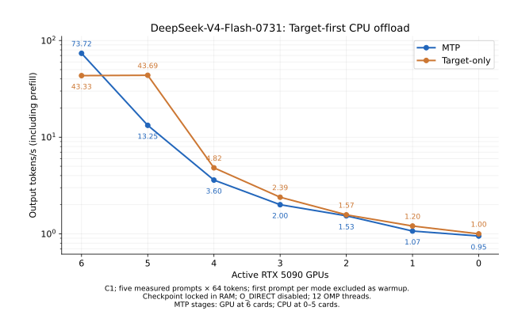

# DeepSeek V4 GPU-to-CPU offload results

The target-first 6-to-0 GPU curve passed within-placement target/MTP token checks. Five GPUs retain all 43 target layers and reach 43.6869 tokens/s with MTP disabled; CPU MTP reaches 13.2518 tokens/s. Placement policy matters, not only GPU count.

| GPUs | GPU / CPU target layers | Target-only tokens/s | MTP tokens/s | MTP vs 6 GPUs | Sum of sampled GPU peaks GiB | Sampled engine RSS GiB |
| ---: | --- | ---: | ---: | ---: | ---: | ---: |
| 6 | 43 / 0 | 43.3322 | 73.7197 | 100.0% | 159.70 | 47.91 |
| 5 | 43 / 0 | 43.6869 | 13.2518 | 18.0% | 148.91 | 47.78 |
| 4 | 35 / 8 | 4.8151 | 3.5954 | 4.9% | 121.38 | 47.83 |
| 3 | 26 / 17 | 2.3903 | 2.0000 | 2.7% | 90.40 | 47.63 |
| 2 | 17 / 26 | 1.5708 | 1.5345 | 2.1% | 59.47 | 47.54 |
| 1 | 8 / 35 | 1.2032 | 1.0672 | 1.4% | 28.51 | 47.47 |
| 0 | 0 / 43 | 0.9983 | 0.9480 | 1.3% | 0.01 | 47.30 |

The engine RSS column excludes a constant **155.425 GiB** read-only checkpoint mapping locked in the campaign parent. It must not be interpreted as total RAM required.

## Evidence checks

- 84/84 complete 64-token requests; no early EOS or nonzero generation result.
- Every MTP output exactly matches the target-only output for the same fixture and placement.
- All 120 requests across the primary and control configurations passed an independent raw-token comparison.
- One pass per mode: no repeated-run confidence interval or median is claimed.
- The six-GPU path matches the earlier 256-token baseline prefix; GPU/CPU arithmetic differs across placements, so cross-placement identity is not claimed.
- 6 GPUs: measured MTP accepted 231/337 draft tokens; sampled process swap 0.0 MiB; total sampled process physical reads 21.33 MiB.
- 5 GPUs: measured MTP accepted 231/333 draft tokens; sampled process swap 0.0 MiB; total sampled process physical reads 0.10 MiB.
- 4 GPUs: measured MTP accepted 234/328 draft tokens; sampled process swap 0.0 MiB; total sampled process physical reads 0.00 MiB.
- 3 GPUs: measured MTP accepted 236/331 draft tokens; sampled process swap 0.0 MiB; total sampled process physical reads 62.06 MiB.
- 2 GPUs: measured MTP accepted 241/302 draft tokens; sampled process swap 0.0 MiB; total sampled process physical reads 0.00 MiB.
- 1 GPUs: measured MTP accepted 233/342 draft tokens; sampled process swap 0.0 MiB; total sampled process physical reads 6.07 MiB.
- 0 GPUs: measured MTP accepted 237/307 draft tokens; sampled process swap 0.0 MiB; total sampled process physical reads 0.08 MiB.

The 62.06 MiB physical-read total for the three-GPU target-first run was first sampled 3.034 seconds after the last output, during teardown; the last pre-output sample recorded only 12 KiB. See `output-times.json` and the raw monitor trace. Expert direct-read counters are zero. Small startup/metadata/library reads are reported rather than hidden.
GPU memory includes the idle driver baseline of approximately 2 MiB per device, including the zero-GPU run.

## Interpretation

Moving even a few layers to CPU introduces serial CPU execution into every target step. MTP acceptance alone does not guarantee throughput gains: batched verification still executes the CPU tail. In the primary curve, all configurations below six GPUs move the drafter stages to CPU. The target-only column helps separate that policy change from the target offload curve.

These are short-context C1 screening results with 12 OMP threads. They do not establish an optimal CPU/NUMA configuration, an optimal layer-placement search, concurrent-serving throughput, or a model-quality evaluation.

## Reproduction artifacts

- `manifest.json`: fixed hardware, workload, placement, numerical and storage limits.
- `offload-results/gpuN.config.json` and `target-first-results/gpuN.config.json`: exact command and environment for each point.
- `offload-results/gpuN.jsonl` and `target-first-results/gpuN.jsonl`: raw per-request times, counters and token IDs.
- `offload-results/gpuN.log`: complete engine and fixture logs.
- `offload-results/gpuN.monitor.jsonl`: 5-second GPU, RAM, swap and I/O samples.
- `offload_campaign.py`: checkpoint RAM locking and sequential campaign runner.
- `experiment.patch`: implementation and benchmark-tool delta from `b258eddb`.
- `source-manifest.json`: source and executable hashes.
- `summary.json`: initial GPU-drafter-first sweep; `target-first-results-summary.json`: additional 5/4/3-GPU controls; `primary-summary.json`: combined target-first curve.
- `summarize.py`, `report.py`, `plot.py`: aggregation, independent raw-token validation and rendering.
- `offload_target_first.py`: target-first 5/4/3-GPU controls.

## Placement controls

The initial policy retained GPU MTP stages at 3–6 GPUs. The additional controls prioritize target layers instead. Every configuration uses the same binary, fixtures, storage controls and timing definition.

| GPUs | Policy | GPU / CPU target layers | Target-only tokens/s | MTP tokens/s |
| ---: | --- | --- | ---: | ---: |
| 5 | GPU drafter first | 40 / 3 | 10.4724 | 10.7932 |
| 5 | Target layers first | 43 / 0 | 43.6869 | 13.2518 |
| 4 | GPU drafter first | 32 / 11 | 3.5933 | 3.4814 |
| 4 | Target layers first | 35 / 8 | 4.8151 | 3.5954 |
| 3 | GPU drafter first | 23 / 20 | 2.1135 | 2.2213 |
| 3 | Target layers first | 26 / 17 | 2.3903 | 2.0000 |

The five-GPU target-first output IDs also match the six-GPU baseline exactly in all 12 requests. This is a particularly useful placement control: moving the drafter to CPU preserves target-only speed while moving three target layers to CPU does not.

Full initial-policy charts and raw evidence are retained in `/home/Kei/colibri/result/dsv4-offload-sweep-20261001`.

## Detailed protocol

This experiment measures CPU offload: a contiguous prefix runs on the selected
RTX 5090 GPUs, and the remaining target layers execute on the CPU. Zero GPUs
means CPU-only target and MTP execution. It does not stream CPU weights through
a GPU for computation.

The primary curve prioritizes target-layer residency. It reuses the unchanged
6/2/1/0-GPU points from the initial sweep and adds target-first 5/4/3-GPU
controls. The initial GPU-drafter-first policy is retained separately.

## Fixed conditions

- Official DeepSeek-V4-Flash-0731 checkpoint, 48 shards / 155.425 GiB.
- Six available RTX 5090 32 GB cards; two Xeon Silver 4510 CPUs; 251 GiB RAM.
- `OMP_NUM_THREADS=12`, no thread-count or NUMA tuning.
- C1, the existing `long6` inputs, 64 generated tokens per request.
- A 16-token target warmup precedes one target-only pass and one MTP pass.
- Each pass executes all six fixtures. Fixture 0 is excluded from timing to
  remove lazy initialization, including the three resident MTP expert banks.
- Throughput is 320 output tokens divided by the sum of generation wall times
  for fixtures 1–5. It includes prefill and excludes model loading and warmup.
- This is a single-pass screening curve, not a three-repeat median. It is not
  directly interchangeable with the previous 256-token, 92.7322 tokens/s result.

## Placement

| GPUs | Target layers on GPU | Target layers on CPU | MTP stages |
| ---: | ---: | ---: | --- |
| 6 | 43 | 0 | GPU |
| 5 | 43 | 0 | CPU |
| 4 | 35 | 8 | CPU |
| 3 | 26 | 17 | CPU |
| 2 | 17 | 26 | CPU |
| 1 | 8 | 35 | CPU |
| 0 | 0 | 43 | CPU |

GPU layers are balanced contiguously over visible devices. The table accounts
for head/MTP workspace, but it is not an exhaustive search for the maximum
number of layers or fastest placement. MTP stages move to CPU below six GPUs;
this policy change must be considered when reading the MTP curve. Target-only
is included as a separate control.

## RAM control

The campaign parent opens every checkpoint shard with a shared, read-only
mapping and `mlock`s all pages. `COLI_V4_DIRECT=0` disables the expert loader's
default direct I/O. Lock setup is outside the timed region. The mapping is
released when the campaign exits; checkpoint contents are never modified.

Without this control, the default expert loader rereads SSD data after cache
misses. That preliminary run was stopped and excluded. The initial seven-layer
per-device placement also left unnecessary GPU capacity and was replaced by the
placement above. Its partial five-GPU timings are excluded.

Engine RSS excludes the constant 155.425 GiB locked checkpoint mapping held by
the campaign parent, so engine RSS alone is not total RAM consumption. Resource
sampling includes `/proc` I/O, swap, available memory, and all six GPUs.

## Correctness and interpretation

Each placement must finish all 12 requests with 64 output tokens, no early EOS,
no runtime error, and exact target/MTP token IDs for each fixture. The six-GPU
implementation was also checked against the previous baseline's token prefix.

GPU FP8 activation quantization/FP4 reduction and CPU arithmetic differ.
Cross-placement token identity is not promised. Passing within-placement token
checks is not a general model-quality evaluation. The experiment uses the
existing single-active-prefix, short-context device path.

The implementation is isolated on `experiment/dsv4-offload-sweep`, based on
`b258eddb`; PR #1815 remains unchanged. The experiment adds GPU-prefix placement
and hybrid CPU/device retained-prefix handling. The existing fixture tool gains
an optional short warmup. CPU/CUDA builds and 22 related Python tests passed.

## Final state

All benchmark processes exited. All six GPUs returned to 2 MiB / 0% utilization,
and locked memory returned to 0 KiB. The vLLM container remains stopped and its
watchdog timer remains disabled/inactive.
