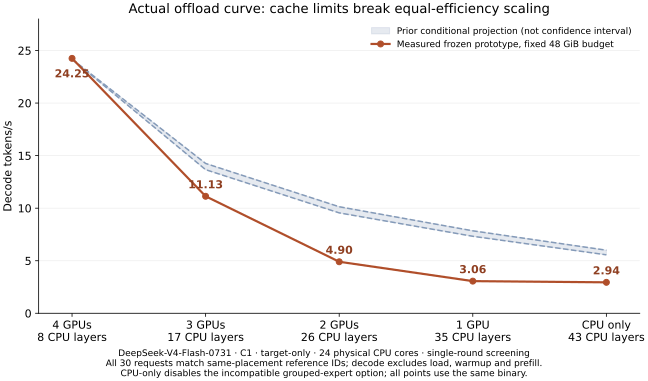

# Measured optimized offload curve: four GPUs to pure CPU

This run replaces conditional estimates with a **measured curve for the unchanged frozen prototype and its existing cache limits**. No kernel, cache-budget or NUMA-placement code was changed for the sweep. These are single-round screening results, not stable performance guarantees. **Pure CPU disables the incompatible experimental grouped-expert option; all points use the same executable.**

| GPUs | GPU / CPU layers | Measured decode tokens/s | Prefill-inclusive output tokens/s | Prior conditional decode projection |
| ---: | ---: | ---: | ---: | ---: |
| 4 | 35 / 8 | **24.2544** | 17.7505 | 24.18 calibration |
| 3 | 26 / 17 | **11.1326** | 8.1704 | 13.7–14.3 |
| 2 | 17 / 26 | **4.9009** | 2.6796 | 9.6–10.1 |
| 1 | 8 / 35 | **3.0592** | 1.6329 | 7.3–7.8 |
| 0 | 0 / 43 | **2.9449** | 1.9087 | 5.6–6.0 |

## Validation and timing

All **30/30 requests** complete with 64 output tokens, no early EOS, no runtime error, no drafted/accepted speculative tokens, and exact token IDs against retained references from the same placement. Four GPUs use the prior optimization reference; three GPUs use the earlier target-first reference; two/one/zero use the earlier offload-sweep references. This is not a claim of token equality across placements or model-quality acceptance.

Each placement uses six `long6` prompts (48–49 tokens), an initial 16-token warmup, and one 64-output-token pass. Fixture 0 is excluded from rates. Decode throughput is 315 intervals divided by summed decode seconds; prefill-inclusive throughput is 320 output tokens divided by summed request wall time for fixtures 1–5. Startup/loading/warmup are excluded from both.

The same `numa-huge-rank4` executable runs all placements with 24 physical cores (CPUs 0–23), ACTIVE OpenMP waiting, 48 GiB engine budget, and checkpoint mappings locked and NUMA-striped by the parent. The frozen binary and source hashes are included in the structured results. Hybrid runs retain the selected optimization options. At zero GPUs, GPU residency/graph/MTP-head requirements are disabled and `V4_CPU_EXPERT_GROUP=0` selects the compatible regular CPU expert path. The frozen grouped prototype rejects unpacked experts in the CPU-only cache. No kernel code is changed.

The warmup log prints a stale `cannot preload resident CUDA experts` string on the GPU cases: the frozen preload function writes that text before attempting work and does not clear it on success. All GPU cases report resident-expert readiness for the intended layer count, and warmup/generation return success. The validator checks actual residency in addition to token IDs; this message is retained, not suppressed.

## Cache and memory behavior

| GPUs | Decode expert requests | Misses | Cache hit rate | Expert-store bytes loaded (GiB) | Peak sampled engine RSS (GiB) |
| ---: | ---: | ---: | ---: | ---: | ---: |
| 4 | 15120 | 0 | 100.00% | 0.000 | 43.44 |
| 3 | 32130 | 359 | 98.88% | 4.470 | 43.39 |
| 2 | 49140 | 3103 | 93.69% | 38.636 | 43.31 |
| 1 | 66150 | 6103 | 90.77% | 75.990 | 43.22 |
| 0 | 81270 | 12695 | 84.38% | 158.068 | 43.07 |

Engine RSS excludes the parent’s **155.425 GiB** locked checkpoint mapping. Sampled process swap is zero at every placement. See structured results for sampled physical-read counters; expert-store byte counters include RAM-backed reads and must not be described as SSD traffic. Pre-existing system swap is not benchmark-process swap.

Four GPUs preload all 2,048 CPU experts and apply row-owned NUMA placement. At three/two/one GPUs, full-tail preload is skipped because the unchanged cache budget cannot hold every CPU expert plus reserved GPU-layer slots. The associated expert NUMA preplacement is therefore skipped too. The frozen dense-placement hook only covers layers 35–42, even when additional earlier layers execute on CPU. Pure CPU uses the existing CPU-only cache path instead of the hybrid preload helper.

These effects occur together: this sweep does not isolate how much slowdown comes from cache misses, packing, NUMA locality, CPU head work or other kernels. The earlier projection assumed preserved CPU efficiency; these results show that assumption does not hold for the current frozen configuration. The fixed-size cache allows one/zero GPUs to execute without requiring the infeasible full-private-copy memory layout discussed in the projection.

Two zero-GPU setup attempts are excluded from timing: forced GPU residency with CUDA disabled failed at engine open (zero tokens); after that was corrected, grouped expert execution failed during warmup (one token). Their logs/configurations are retained under `results/failed-setups`. The completed CPU point uses the compatibility overrides above and is not evidence that the grouped optimization works on the CPU-only cache.

## Reproduction and publication boundary

Raw configurations, campaign/validation scripts, token dumps, logs and resource traces: `/home/Kei/colibri/result/dsv4-offload-measured-20261002`; remote mirror: `/data/test/colibri-offload-measured-20261002`. The [structured results](dsv4-offload-measured-2026-10-02-results.json) contain timing, cache counters, per-placement validation and source hashes.

The measured runner includes isolated research optimizations not integrated into the default PR implementation. No new six/five-GPU performance claim is made. The original prefill-inclusive historical sweep remains unchanged; the [conditional projection](dsv4-offload-projection-2026-10-02.md) is retained as a forecast audit, not relabeled as measurement.

Final host check: all six GPUs are idle (2 MiB, 0% utilization), no campaign/runner remains, and `Mlocked` is zero. vLLM and its watchdog remain stopped.
