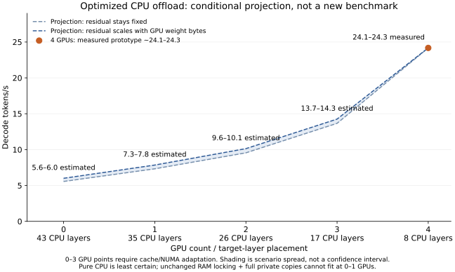

# Optimized CPU offload: conditional four-to-zero GPU curve

**Measured follow-up (2026-10-02):** [The four-to-zero GPU sweep](dsv4-offload-measured-2026-10-02.md) records **24.25 / 11.13 / 4.90 / 3.06 / 2.94 decode tokens/s** for the frozen prototype. Low-GPU projections did not hold under the existing cache limits; the CPU-only point uses the documented compatible expert path. Historical results below are preserved.

This is a **projection from existing records**, not a new benchmark. It answers how the four-GPU prototype's efficiency might translate to smaller GPU prefixes if CPU cache behavior and NUMA locality can be preserved. It does not claim that changing `V4_GPU_LAYERS` alone achieves these rates. No inference experiment was run for this update.



| GPUs | GPU / CPU target layers | Decode tokens/s | Evidence |
| ---: | ---: | ---: | --- |
| 4 | 35 / 8 | **24.1–24.3** | Existing uninstrumented prototype screens; diagnostic calibration 24.1765 |
| 3 | 26 / 17 | **13.7–14.3** | Conditional projection |
| 2 | 17 / 26 | **9.6–10.1** | Conditional projection |
| 1 | 8 / 35 | **7.3–7.8** | Conditional projection; memory strategy must change |
| 0 | 0 / 43 | **5.6–6.0** | Conditional projection; memory strategy and CPU head need separate treatment |

Rates are short-context, concurrency-one, target-only **decode** throughput for DeepSeek-V4-Flash-0731 on the recorded dual-Xeon Silver 4510 / RTX 5090 host. CPU offload means computation on CPU/RAM. The intervals are the spread between two accounting assumptions, **not confidence intervals, guaranteed bounds or validated operating ranges**. Actual rates could be lower or higher. These estimates describe the optimized isolated prototype, not the integrated 15.5838-tokens/s code in #1818.

## Calculation

The measured four-GPU CPU blocks cost `C4 = 28.146736 ms/token`; the GPU and other residual costs `R4 = 13.215793 ms/token`. Active checkpoint weight bytes come from the earlier hardware inventory. The zero-GPU point moves the vocabulary-head weight bytes to the CPU total.

```text
T_ms(N, F) = C4 * Wcpu(N) / Wcpu(4)
          + F + (R4 - F) * Wgpu(N) / Wgpu(4)
R_decode(N, F) = 1000 / T_ms(N, F)
0 <= F <= R4
```

`F` is an unknown fixed portion of the measured residual. `F = 0` scales the entire residual with remaining GPU weight bytes; `F = R4` retains it unchanged. Neither endpoint is known to be physically correct: in particular, the GPU head, transfers and host scheduling need not follow weight-byte ratios. Both endpoints reproduce the four-GPU calibration; agreement there is not an independent validation.

| GPUs | CPU active weight GB/token | GPU active weight GB/token |
| ---: | ---: | ---: |
| 4 | 1.895102144 | 9.322199560 |
| 3 | 4.037719512 | 7.179582192 |
| 2 | 6.159081968 | 5.058219736 |
| 1 | 8.301699336 | 2.915602368 |
| 0 | 11.217301704 | 0 |

The major unvalidated assumption is that CPU execution cost remains proportional to active weight bytes as more layers move to CPU. Attention patterns, kernel mix, cache misses, NUMA ownership and memory pressure can break that assumption. Pure CPU is the least certain point because the vocabulary head and the CPU-only expert-cache path differ from the measured hybrid tail. Five/six GPU predictions are omitted: a CPU-tail calibration cannot validate the no-CPU regime.

## Why the current configuration cannot simply follow the curve

The measured runner has `43 * 66 = 2,838` expert-cache slots. Full CPU expert residency requires 256 experts per CPU layer, while reserving at least 16 slots per GPU layer. The preload admission check therefore needs at least:

| GPUs | Minimum full-preload slots | Locked checkpoint + private CPU experts, GiB (lower bound) |
| ---: | ---: | ---: |
| 4 | 2,608 | 180.93 |
| 3 | 4,768 | 209.61 |
| 2 | 6,928 | 238.30 |
| 1 | 9,088 | 266.99 |
| 0 | 11,008 | 292.49 |

The slot figures below four GPUs exceed the present budget; hybrid full-tail preload would be skipped. The CPU-only path does not use that hybrid preload helper, so its slot figure is a full-residency requirement, not a prediction of the helper's behavior. This can change cache-miss and packing costs enough to invalidate the projected curve.

The memory lower bound adds the retained 155.425 GiB locked checkpoint to `CPU layers * 256 * 13,369,344` bytes of expert weights. It excludes dense weights, additional packing copies, KV, scratch space, allocator overhead and the OS. Even this lower bound exceeds the host's approximately 251 GiB RAM at one and zero GPUs. Two GPUs leave little space for omitted costs and are not established to fit. Reusing checkpoint storage, changing packing/cache ownership or selectively locking memory would be necessary options to investigate; their speed effects are not measured here.

## Publication boundary

The [original six-to-zero sweep](dsv4-cpu-offload-2026-10-01.md) remains historical measured evidence. Its rates include prefill and used older code/thread settings; they are not overwritten by this decode-only projection or plotted as comparable points. The [roofline study](dsv4-cpu-roofline-gap-2026-10-01.md) retains the actual four-GPU measurements, failures and ideal streaming roof.

The [calculation and chart script](dsv4-offload-projection-2026-10-02.py) reproduces the [structured projection](dsv4-offload-projection-2026-10-02.json) and SVG using only embedded inventory values and recorded phase costs. It performs no remote access or inference. The curves provide conditional planning numbers, not a claim that the three-, two-, one- or zero-GPU optimized configurations have been implemented or validated.
