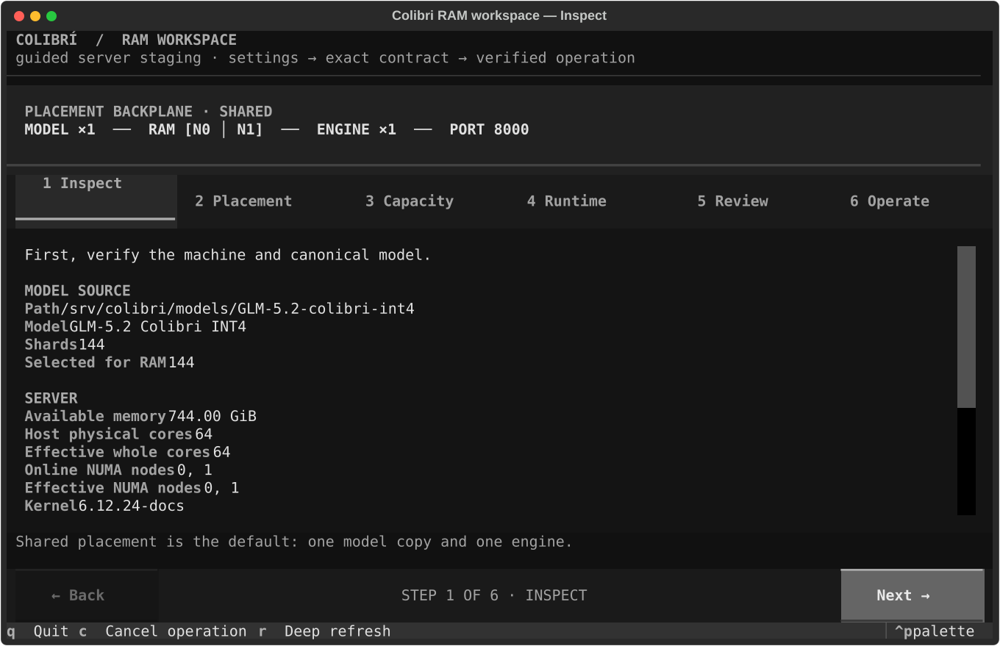
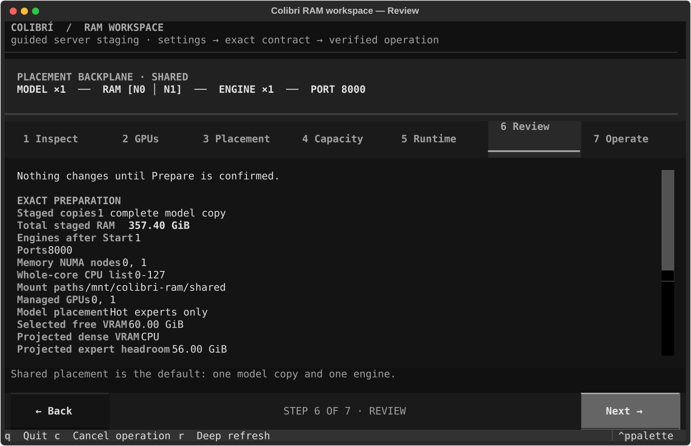
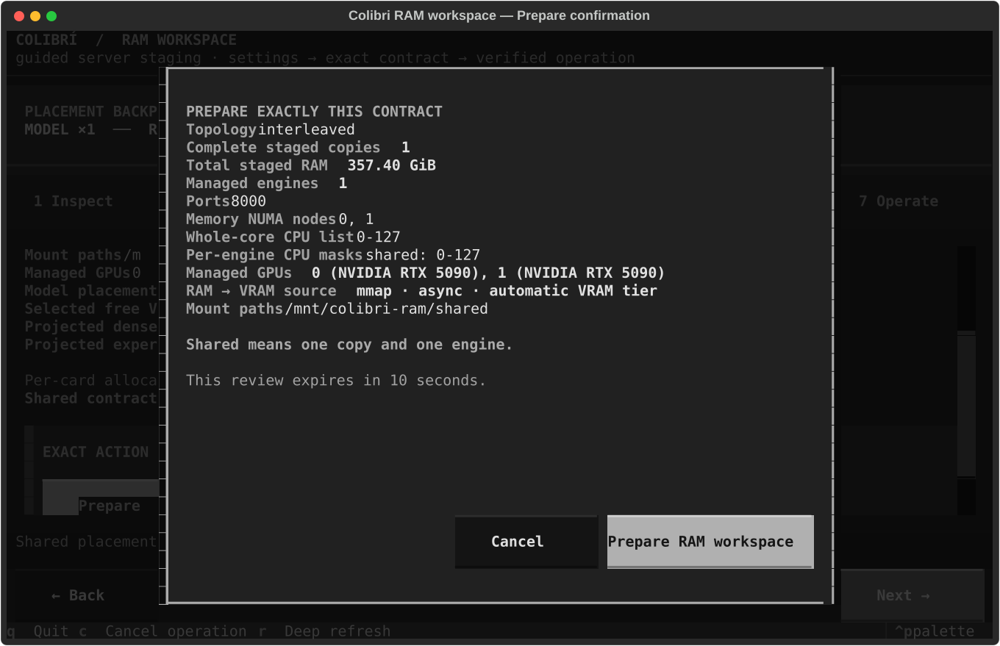
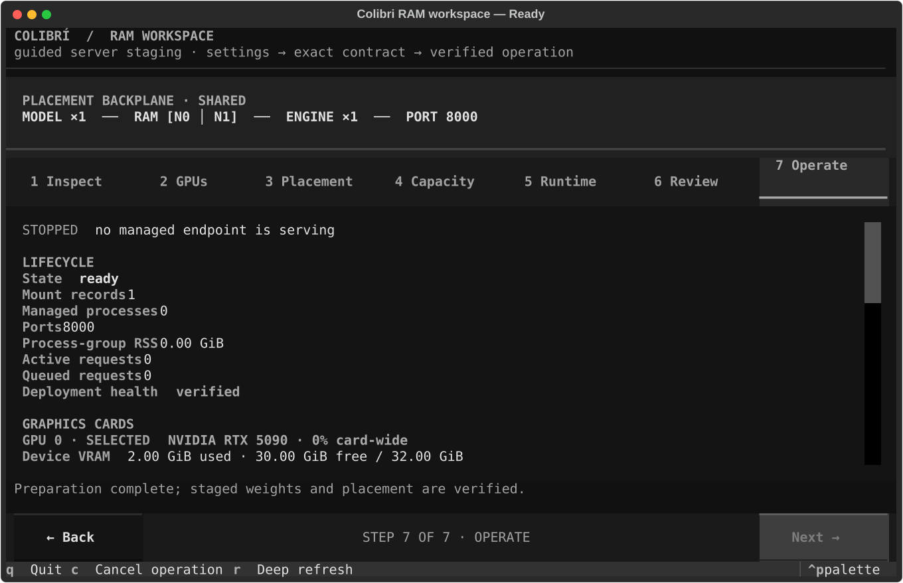
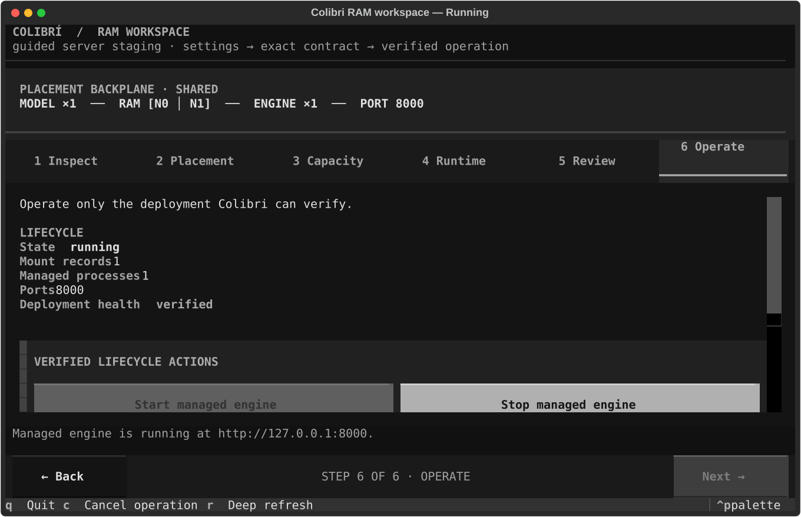
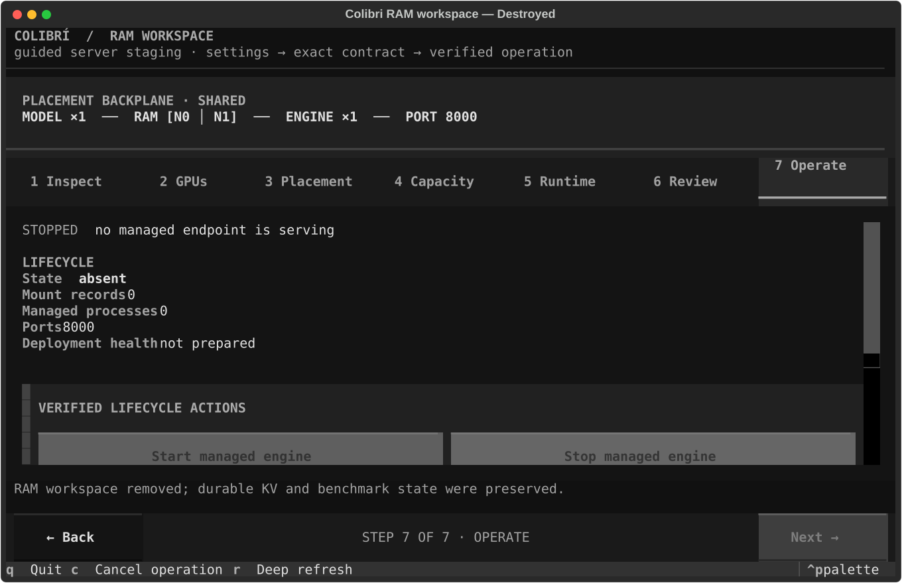

# Run a shared full-model RAM workspace

This how-to walks through one complete RAM-workspace lifecycle in the Textual
interface:

`launch → select GPUs → review → prepare → start → verify → stop → destroy`

It is for Linux operators who are comfortable in a terminal and have a host
large enough to stage the complete model. The result is one model copy placed
across the selected GPU-local NUMA nodes and one managed CUDA engine.

This guide does not cover partial staging, per-node replication, benchmarking,
or performance tuning. See the [RAM-workspace TUI reference](ramdisk-tui.md)
for those modes and the complete control reference.

## Before you begin

You need:

- a Linux host with visible NUMA and cgroup information;
- one or more NVIDIA GPUs visible to `nvidia-smi`;
- a CUDA-capable Colibri engine;
- a canonical model directory on durable storage;
- enough host, NUMA-node, and cgroup memory headroom for the complete staged
  model, runtime overhead, page tables, and the operating-system reserve;
- a terminal at least 72 columns by 24 rows;
- a non-symlink mount root below `/mnt`, such as `/mnt/colibri-ram`; and
- permission to run `sudo -v` interactively and then reuse that authorization
  noninteractively.

The default mount root is `/mnt/colibri-ram`. Leave it absent, or make sure an
existing root is an empty, non-symlink directory with restrictive permissions
that is not writable by the invoking user. Keep the model and Colibri's state
directory on durable storage outside the mount root.

Check that your sudo policy can reuse a foreground authorization:

```sh
sudo -v
sudo -n -v
```

Both commands must succeed. They do not mount anything. The TUI performs the
same authorization check immediately before a privileged operation.

> [!CAUTION]
> Do not continue while the planner reports a blocker. Do not bypass a
> memory, cgroup, placement, mount-root, symlink, swap, or sudo-policy blocker
> merely to enable Prepare.

## 1. Launch the TUI

From a source checkout, install the Python package and build the engine once:

```sh
cd /path/to/colibri
python3 -m pip install -e .
make -C c CUDA=1
```

The editable install includes the supported Textual dependency. Launch the
source-checkout console with an absolute path to your model:

```sh
COLI_RAMDISK_UI=textual ./c/coli ramdisk \
  --model /absolute/path/to/model \
  --mount-root /mnt/colibri-ram \
  --gpu auto \
  --gpu-layout experts-only
```

If Colibri is already installed, invoke `coli` from `PATH` instead:

```sh
COLI_RAMDISK_UI=textual coli ramdisk \
  --model /absolute/path/to/model \
  --mount-root /mnt/colibri-ram \
  --gpu auto \
  --gpu-layout experts-only
```

An installed package still needs a compatible native engine. If its installer
did not provide one, set `COLI_ENGINE` to the engine's absolute path before
launching.

Launch with `CUDA_VISIBLE_DEVICES` unset. The RAM-workspace planner selects
physical cards by stable UUID and creates its own reviewed visible-device
mapping; it fails closed rather than composing that mapping with an ambient
mask.

When the preset prompt opens, choose **Fastest GPU staging**. It populates a
full, shared draft with one model copy and one engine, selects every eligible
NVIDIA GPU, and opens **Accelerators**. Nothing is mounted, copied, or started
yet.

Planning and inspection are unprivileged. On **Inspect**, wait for the model
and host scan to finish. Confirm that the canonical model path and discovered
hardware describe the intended host.



*Illustrative capture: hardware, capacity, paths, identifiers, and endpoints
use deterministic example data. Verify every value on your host.*

## 2. Select accelerators and review the plan

Use the numbered tabs, `Left` and `Right`, or the **Back** and **Next** buttons
to review all seven steps.

1. On **Inspect**, confirm the canonical model, shard count, effective CPUs,
   and available NUMA nodes.
2. On **Accelerators**, select the exact GPUs that the managed engine may use.
   The preset selects all eligible cards by default. An unusable card is
   disabled and shows why it cannot be selected.
3. Keep **Hot experts only** for this stable workflow. Dense tensors remain on
   the CPU while usage-ranked hot experts occupy the automatic VRAM tier.
   **Dense + GPU attention** and **Dense + sharded attention** are experimental;
   sharded attention requires at least two selected cards.
4. On **Placement**, confirm the GPU-local memory nodes and whole-core CPU
   list. Confirm that the mount root is the safe path you prepared.
5. On **Capacity**, select **Stage full model**. Check the total staged RAM,
   runtime requirement, current headroom, and operating-system reserve.
6. On **Runtime**, confirm the base port, context length, copy-worker count,
   prefault setting, and huge-page policy. Copy workers affect staging speed;
   they do not create additional model copies.
7. On **Review**, compare the exact contract with what you intend to deploy.

While placement remains automatic, changing the GPU selection also selects
the GPU-local NUMA nodes and their effective whole-core CPUs. Editing either
placement field makes those masks custom; later GPU changes preserve them.
The plan is blocked if a selected GPU falls outside the custom memory-node
mask. Use **Reset to GPU-local** to derive both masks again.

Before continuing, the contract must show:

- topology `interleaved`;
- full staging mode;
- one complete staged copy;
- one managed engine;
- the intended GPU indices and stable device identities;
- model placement `Hot experts only`;
- the intended memory NUMA nodes;
- a complete physical-core CPU selection;
- the canonical model and mount paths;
- the intended endpoint;
- no blockers; and
- only warnings that you understand and accept.

If you edit a field, press `Enter` or navigate away to submit it. Wait for the
authoritative plan to rebuild before reviewing again. Invalid input leaves
lifecycle actions disabled.



*Illustrative capture: hardware, capacity, paths, identifiers, and endpoints
use deterministic example data. Verify every value on your host.*

## 3. Prepare the workspace

On **Review**, select **Prepare RAM workspace**. The confirmation repeats the
copy count, RAM cost, engine count, ports, selected GPUs, model placement,
NUMA nodes, whole-core CPU list, and mount paths.

The confirmation is bound to the exact plan and expires after ten seconds.
Select **Prepare RAM workspace** in the confirmation only if every value still
matches the contract you reviewed.



*Illustrative capture: hardware, capacity, paths, identifiers, and endpoints
use deterministic example data. Verify every value on your host.*

The TUI temporarily suspends to request foreground sudo authorization. After
authorization succeeds, it returns and shows copy progress. Prepare then:

1. mounts the reviewed tmpfs workspace;
2. copies every model shard;
3. constructs the staged weights namespace;
4. verifies the source fingerprint; and
5. validates mount identity and NUMA placement.

Prepare does not start the engine. Wait until the lifecycle state is `ready`.
Press `r` for a deep refresh and confirm that deployment health is `verified`.
A verified deep refresh includes mount identity, staged namespace, source
fingerprint, and lifecycle validation.



*Illustrative capture: hardware, capacity, paths, identifiers, and endpoints
use deterministic example data. Verify every value on your host.*

If you must cancel Prepare, press `c` once and wait. Cancellation is
cooperative: Colibri finishes its current safe checkpoint and rolls back
mounts created by the operation. Do not kill the TUI while rollback is active.

## 4. Start and verify the engine

Go to **Operate** and select **Start managed engine**. Wait until the state is
`running`, then press `r` for a deep refresh.

Verify:

- the placement rail shows one model copy and one engine;
- the endpoint is the port reviewed under **Runtime**;
- the state is `running`;
- the managed-process count is one;
- the mount-record count matches the reviewed contract; and
- deployment health is `verified`; and
- the serving banner reads `SERVING ✓`.

The `verified` health state means that Colibri matched the managed process
identity, verified the tmpfs mount and staged namespace, and confirmed that the
durable model still matches the prepared source fingerprint. The CPU mask
remains the whole-core mask accepted on **Review**.

`SERVING ✓` is a separate, live assertion: the managed process identity is
verified and every expected endpoint has returned `{"status":"ok"}` from
`GET /health`. A merely `running` lifecycle state does not make that claim.

The console samples serving and GPU telemetry every two seconds. In
**Operate**, verify:

- active and queued request counts;
- aggregate expert placement across VRAM, RAM, and disk;
- card-wide utilization and total/used/free VRAM for each selected GPU;
- VRAM attributed to the verified Colibri process group;
- exact model-resident, hot-expert, and non-expert bytes reported by the
  engine; and
- aggregate request-wide tok/s, TTFT, and phase timings after the first request
  completes.

The card-wide value includes the driver and other processes. Colibri process
VRAM includes all allocations attributed to the managed processes.
Model-resident VRAM is the engine-owned tensor allocation, divided into
hot-expert and non-expert bytes. These values answer different questions and
are not expected to match.

Review shows capacity estimates based on free VRAM, the projected dense set,
and a 2 GiB reserve per selected card. Operate shows the exact placement after
the engine loads. Aggregate tok/s and TTFT describe the completed request as a
whole; Colibri does not claim per-card token rates.

If a sample fails, the last successful value remains visible with `STALE` and
its observation time. `DEGRADED` means at least one expected endpoint is not
currently proven healthy. Stop and Destroy remain available according to the
lifecycle state even when monitoring is stale.

During an active request, model-placement and tier values are marked stale
because lazy uploads or repinning can still change them. They become fresh
again only after the request is quiescent and every engine publishes a newer
GPU placement sequence.



*Illustrative capture: hardware, capacity, paths, identifiers, and endpoints
use deterministic example data. Verify every value on your host.*

## 5. Stop without restaging

On **Operate**, select **Stop managed engine** and wait for cleanup to finish.
Stop verifies the persisted process identity before signaling its process
group.

Press `r` and confirm:

- the state is `stopped`;
- no managed engine is running;
- the verified mount remains present; and
- **Start managed engine** is available again.

The staged weights stay mounted, so you can restart without copying the model
again.


*Illustrative capture: hardware, capacity, paths, identifiers, and endpoints
use deterministic example data. Verify every value on your host.*

## 6. Destroy the workspace

Select **Destroy volatile workspace**. If the action is disabled, finish Stop
first.

The confirmation identifies the persisted deployment and exact mounts that
will be removed. Check them carefully, then select **Destroy volatile
workspace** before the ten-second confirmation expires. The TUI may suspend
again to renew sudo authorization.

Destroy is a verified cleanup transaction and cannot be cancelled halfway
through. Wait for it to finish. It unmounts the volatile weight workspace and
removes its manifest. It does not modify the canonical model, and it preserves
durable usage, KV, and benchmark history.

Press `r` and confirm that the lifecycle state is `absent`, with no managed
processes or mount records.



*Illustrative capture: hardware, capacity, paths, identifiers, and endpoints
use deterministic example data. Verify every value on your host.*

## Troubleshooting the lifecycle

**Prepare is disabled**

Return to **Capacity** and resolve every `NOT READY` item. Typical blockers are
insufficient host or cgroup memory, NUMA-node headroom, an incomplete
physical-core selection, or an unsafe mount root.

**The sudo prompt returns without mounting**

Run `sudo -v` followed by `sudo -n -v` in another terminal. If the second
command fails, the current sudo policy cannot provide the noninteractive reuse
required by the background lifecycle worker. Correct the policy or ask the
host administrator; Colibri will not open a background password prompt.

**A refresh reports changed CPU or NUMA masks**

The process's cgroup or cpuset boundary no longer matches the prepared
contract. Restore the original boundary, or stop and destroy the workspace
before preparing a new plan.

**The banner says `DEGRADED` or telemetry is stale**

Read the endpoint row in **Operate**. Confirm that the managed process identity
is verified and that every reviewed loopback port answers `GET /health`.
Correct an API-key mismatch in the TUI environment if the server requires one.
Card telemetry also requires a working `nvidia-smi`. Stale monitoring does not
by itself authorize a lifecycle mutation.

**A previously prepared GPU workspace says its ordinal mapping is unsafe**

Older manifests did not persist the UUID-to-logical-ordinal mapping required
for unambiguous launch and telemetry attribution. Stop the deployment, Destroy
the RAM workspace, and Prepare it again with this version.

**Cancellation or rollback is still active**

Wait for the operation-status message to report completion. A quit request
also waits for rollback. Starting another action or terminating the process
cannot make partial cleanup safe.

**Destroy is disabled**

Select **Stop managed engine** first. Destroy becomes available only when no
managed engine cleanup is pending.

For all controls, lifecycle states, durable-state paths, partial staging,
replication, benchmarking, and deeper recovery guidance, see the
[RAM-workspace TUI reference](ramdisk-tui.md).

## Completion checklist

Before leaving the host, verify that:

- the TUI reports lifecycle state `absent`;
- no managed Colibri engine remains;
- no managed RAM-workspace mount remains;
- the canonical model directory is unchanged; and
- expected durable usage, KV, and benchmark state remains available.

Press `q` to exit the TUI.
